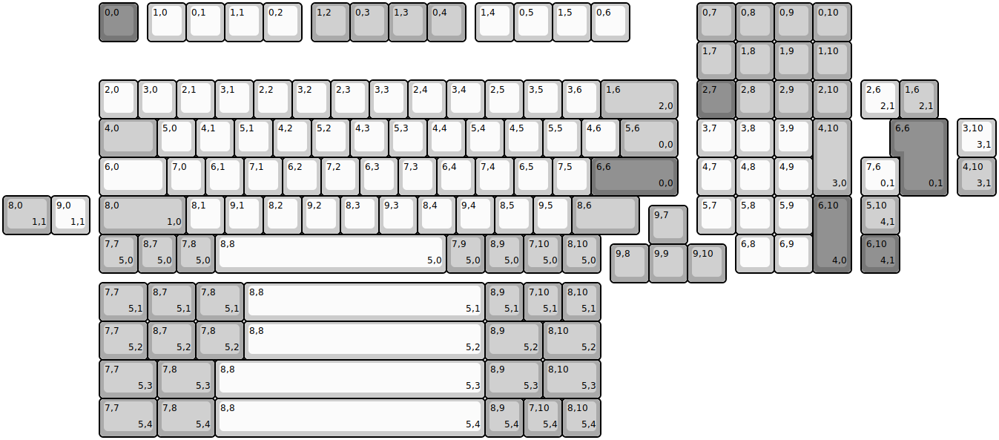
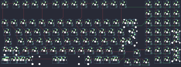

## evyd13/gh80_1800

[layout](gh80_1800-kle.json) - [PCB](gh80_1800.kicad_pcb)

{:loading="lazy"}

[Open in keyboard-layout-editor](http://www.keyboard-layout-editor.com/##@@_x:2.5&c=#777777;&=0,0&_x:0.25&c=#cccccc;&=1,0&=0,1&=1,1&=0,2&_x:0.25&c=#aaaaaa;&=1,2&=0,3&=1,3&=0,4&_x:0.25&c=#cccccc;&=1,4&=0,5&=1,5&=0,6&_x:1.75&c=#aaaaaa;&=0,7&=0,8&=0,9&=0,10;&@_x:18;&=1,7&=1,8&=1,9&=1,10;&@_x:2.5&c=#cccccc;&=2,0&=3,0&=2,1&=3,1&=2,2&=3,2&=2,3&=3,3&=2,4&=3,4&=2,5&=3,5&=3,6&_c=#aaaaaa&w:2;&=1,6%0A%0A%0A2,0&_x:0.5&c=#777777;&=2,7&_c=#aaaaaa;&=2,8&=2,9&=2,10;&@_x:2.5&w:1.5;&=4,0&_c=#cccccc;&=5,0&=4,1&=5,1&=4,2&=5,2&=4,3&=5,3&=4,4&=5,4&=4,5&=5,5&=4,6&_c=#aaaaaa&w:1.5;&=5,6%0A%0A%0A0,0&_x:0.5&c=#cccccc;&=3,7&=3,8&=3,9&_c=#aaaaaa&h:2;&=4,10%0A%0A%0A3,0;&@_x:2.5&c=#cccccc&w:1.75;&=6,0&=7,0&=6,1&=7,1&=6,2&=7,2&=6,3&=7,3&=6,4&=7,4&=6,5&=7,5&_c=#777777&w:2.25;&=6,6%0A%0A%0A0,0&_x:0.5&c=#cccccc;&=4,7&=4,8&=4,9;&@_x:2.5&c=#aaaaaa&w:2.25;&=8,0%0A%0A%0A1,0&_c=#cccccc;&=8,1&=9,1&=8,2&=9,2&=8,3&=9,3&=8,4&=9,4&=8,5&=9,5&_c=#aaaaaa&w:1.75;&=8,6&_x:1.5&c=#cccccc;&=5,7&=5,8&=5,9&_c=#777777&h:2;&=6,10%0A%0A%0A4,0;&@_x:16.75&y:-0.75&c=#aaaaaa;&=9,7;&@_x:2.5&y:-0.25;&=7,7%0A%0A%0A5,0&=8,7%0A%0A%0A5,0&=7,8%0A%0A%0A5,0&_c=#cccccc&w:6;&=8,8%0A%0A%0A5,0&_c=#aaaaaa;&=7,9%0A%0A%0A5,0&=8,9%0A%0A%0A5,0&=7,10%0A%0A%0A5,0&=8,10%0A%0A%0A5,0&_x:3.5&c=#cccccc;&=6,8&=6,9;&@_x:15.75&y:-0.75&c=#aaaaaa;&=9,8&=9,9&=9,10;&@_x:22.25&y:-5.25&c=#cccccc;&=2,6%0A%0A%0A2,1&_c=#aaaaaa;&=1,6%0A%0A%0A2,1;&@_x:23.25&c=#777777&w:1.25&h:2&w2:1.5&h2:1&x2:-0.25;&=6,6%0A%0A%0A0,1&_x:0.25&c=#cccccc;&=3,10%0A%0A%0A3,1;&@_x:22.25;&=7,6%0A%0A%0A0,1&_x:1.5&c=#aaaaaa;&=4,10%0A%0A%0A3,1;&@_w:1.25;&=8,0%0A%0A%0A1,1&_c=#cccccc;&=9,0%0A%0A%0A1,1&_x:20.0&c=#aaaaaa;&=5,10%0A%0A%0A4,1;&@_x:22.25&c=#777777;&=6,10%0A%0A%0A4,1;&@_x:2.5&y:0.25&c=#aaaaaa&w:1.25;&=7,7%0A%0A%0A5,1&_w:1.25;&=8,7%0A%0A%0A5,1&_w:1.25;&=7,8%0A%0A%0A5,1&_c=#cccccc&w:6.25;&=8,8%0A%0A%0A5,1&_c=#aaaaaa;&=8,9%0A%0A%0A5,1&=7,10%0A%0A%0A5,1&=8,10%0A%0A%0A5,1;&@_x:2.5&w:1.25;&=7,7%0A%0A%0A5,2&_w:1.25;&=8,7%0A%0A%0A5,2&_w:1.25;&=7,8%0A%0A%0A5,2&_c=#cccccc&w:6.25;&=8,8%0A%0A%0A5,2&_c=#aaaaaa&w:1.5;&=8,9%0A%0A%0A5,2&_w:1.5;&=8,10%0A%0A%0A5,2;&@_x:2.5&w:1.5;&=7,7%0A%0A%0A5,3&_w:1.5;&=7,8%0A%0A%0A5,3&_c=#cccccc&w:7;&=8,8%0A%0A%0A5,3&_c=#aaaaaa&w:1.5;&=8,9%0A%0A%0A5,3&_w:1.5;&=8,10%0A%0A%0A5,3;&@_x:2.5&w:1.5;&=7,7%0A%0A%0A5,4&_w:1.5;&=7,8%0A%0A%0A5,4&_c=#cccccc&w:7;&=8,8%0A%0A%0A5,4&_c=#aaaaaa;&=8,9%0A%0A%0A5,4&=7,10%0A%0A%0A5,4&=8,10%0A%0A%0A5,4)

{:loading="lazy"}

