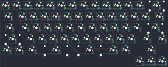

## evyd13/nt650

[layout](nt650-kle.json) - [PCB](nt650.kicad_pcb)

{:loading="lazy"}

[Open in keyboard-layout-editor](http://www.keyboard-layout-editor.com/##@@_c=#777777;&=0,0&_c=#cccccc;&=1,0&=1,1&=1,2&=1,3&=2,3&=2,4&=1,4&=1,5&=1,6&=1,7&=2,7&=2,5&_c=#aaaaaa&w:2;&=3,8;&@_w:1.5;&=3,0&_c=#cccccc;&=5,0&=5,1&=5,2&=5,3&=3,3&=3,4&=5,4&=5,5&=5,6&=5,7&=3,7&=3,5&_c=#aaaaaa&w:1.5;&=4,8;&@_w:1.75;&=3,1&_c=#cccccc;&=4,0&=4,1&=4,2&=4,3&=0,3&=0,4&=4,4&=4,5&=4,6&=4,7&=0,7&_c=#777777&w:2.25;&=6,8;&@_c=#aaaaaa&w:2.25;&=3,10&_c=#cccccc;&=6,0&=6,1&=6,2&=6,3&=7,3&=7,4&=6,4&=6,5&=6,6&=7,7&_c=#aaaaaa&w:1.75;&=4,10&=3,9;&@_w:1.25;&=2,11&=3,11&_w:1.25;&=0,9&_c=#cccccc&w:3;&=0,13&_w:3;&=6,9&_c=#aaaaaa&w:1.25;&=7,9&=6,11&_x:1.25&c=#777777;&=0,12;&@_x:12;&=7,12&=7,13&=7,14)

{:loading="lazy"}

