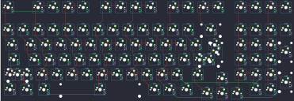

## evyd13/nt980

[layout](nt980-kle.json) - [PCB](nt980.kicad_pcb)

{:loading="lazy"}

[Open in keyboard-layout-editor](http://www.keyboard-layout-editor.com/##@@_c=#777777;&=0,0&_x:1&c=#cccccc;&=0,1&=1,1&=0,2&=1,2&_x:0.5&c=#aaaaaa;&=0,3&=1,3&=0,4&=1,4&_x:0.5&c=#cccccc;&=0,5&=1,5&=0,6&=1,6&_x:0.5&c=#aaaaaa;&=0,7&=1,7&=0,8&=1,8;&@_y:0.5&c=#cccccc;&=2,0&=3,0&=2,1&=3,1&=2,2&=3,2&=2,3&=3,3&=2,4&=3,4&=2,5&=3,5&=2,6&_c=#aaaaaa&w:2;&=3,6&_x:0.5;&=2,7&=3,7&=2,8&=3,8;&@_w:1.5;&=4,0&_c=#cccccc;&=5,0&=4,1&=5,1&=4,2&=5,2&=4,3&=5,3&=4,4&=5,4&=4,5&=5,5&=4,6&_w:1.5;&=5,6%0A%0A%0A0,0&_x:0.5;&=4,7&=5,7&=4,8&_c=#aaaaaa&h:2;&=5,8;&@_w:1.75;&=6,0&_c=#cccccc;&=7,0&=6,1&=7,1&=6,2&=7,2&=6,3&=7,3&=6,4&=7,4&=6,5&=7,5&_c=#777777&w:2.25;&=7,6%0A%0A%0A0,0&_x:0.5&c=#cccccc;&=6,7&=7,7&=6,8;&@_c=#aaaaaa&w:2.25;&=8,0%0A%0A%0A1,0&_c=#cccccc;&=8,1&=9,1&=8,2&=9,2&=8,3&=9,3&=8,4&=9,4&=8,5&=9,5&_c=#aaaaaa&w:1.75;&=8,6&_x:1.5&c=#cccccc;&=8,7&=9,7&=8,8&_c=#777777&h:2;&=9,8;&@_x:14.25&y:-0.75&c=#aaaaaa;&=9,6;&@_y:-0.25&w:1.25;&=10,0&=11,0&_w:1.25;&=10,1&_c=#cccccc&w:6.25;&=10,3&_c=#aaaaaa;&=11,4&=10,5&_w:1.25;&=11,5&_x:3.5&c=#cccccc;&=11,7&=10,8;&@_x:13.25&y:-0.75&c=#aaaaaa;&=10,6&=11,6&=10,7;&@_y:0.25&w:1.25;&=8,0%0A%0A%0A1,1&=9,0%0A%0A%0A1,1&_x:11.5&c=#777777&w:1.25&h:2&w2:1.5&h2:1&x2:-0.25;&=7,6%0A%0A%0A0,1;&@_x:12.75&c=#cccccc;&=6,6%0A%0A%0A0,1)

{:loading="lazy"}

