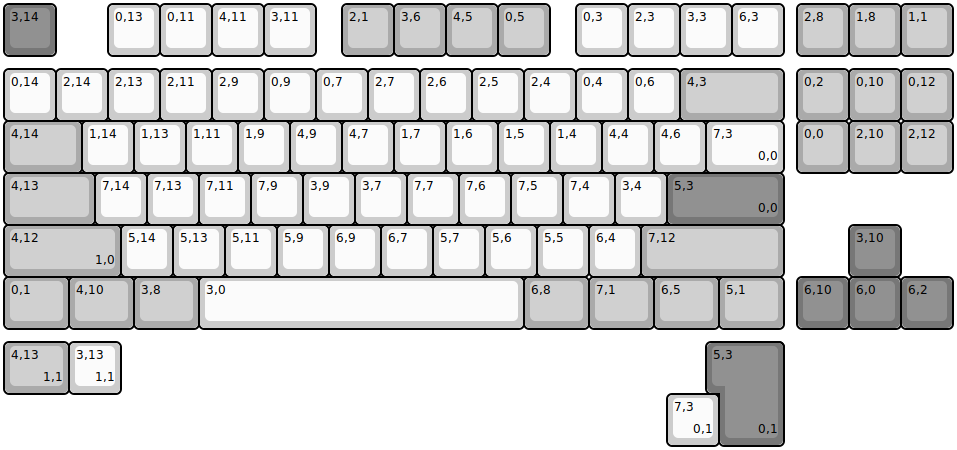
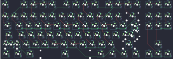

## evyd13/quackfire

[layout](quackfire-kle.json) - [PCB](quackfire.kicad_pcb)

{:loading="lazy"}

[Open in keyboard-layout-editor](http://www.keyboard-layout-editor.com/##@@_c=#777777;&=3,14&_x:1&c=#cccccc;&=0,13&=0,11&=4,11&=3,11&_x:0.5&c=#aaaaaa;&=2,1&=3,6&=4,5&=0,5&_x:0.5&c=#cccccc;&=0,3&=2,3&=3,3&=6,3&_x:0.25&c=#aaaaaa;&=2,8&=1,8&=1,1;&@_y:0.25&c=#cccccc;&=0,14&=2,14&=2,13&=2,11&=2,9&=0,9&=0,7&=2,7&=2,6&=2,5&=2,4&=0,4&=0,6&_c=#aaaaaa&w:2;&=4,3&_x:0.25;&=0,2&=0,10&=0,12;&@_w:1.5;&=4,14&_c=#cccccc;&=1,14&=1,13&=1,11&=1,9&=4,9&=4,7&=1,7&=1,6&=1,5&=1,4&=4,4&=4,6&_w:1.5;&=7,3%0A%0A%0A0,0&_x:0.25&c=#aaaaaa;&=0,0&=2,10&=2,12;&@_w:1.75;&=4,13&_c=#cccccc;&=7,14&=7,13&=7,11&=7,9&=3,9&=3,7&=7,7&=7,6&=7,5&=7,4&=3,4&_c=#777777&w:2.25;&=5,3%0A%0A%0A0,0;&@_c=#aaaaaa&w:2.25;&=4,12%0A%0A%0A1,0&_c=#cccccc;&=5,14&=5,13&=5,11&=5,9&=6,9&=6,7&=5,7&=5,6&=5,5&=6,4&_c=#aaaaaa&w:2.75;&=7,12&_x:1.25&c=#777777;&=3,10;&@_c=#aaaaaa&w:1.25;&=0,1&_w:1.25;&=4,10&_w:1.25;&=3,8&_c=#cccccc&w:6.25;&=3,0&_c=#aaaaaa&w:1.25;&=6,8&_w:1.25;&=7,1&_w:1.25;&=6,5&_w:1.25;&=5,1&_x:0.25&c=#777777;&=6,10&=6,0&=6,2;&@_y:0.25&c=#aaaaaa&w:1.25;&=4,13%0A%0A%0A1,1&_c=#cccccc;&=3,13%0A%0A%0A1,1&_x:11.5&c=#777777&w:1.25&h:2&w2:1.5&h2:1&x2:-0.25;&=5,3%0A%0A%0A0,1;&@_x:12.75&c=#cccccc;&=7,3%0A%0A%0A0,1)

{:loading="lazy"}

