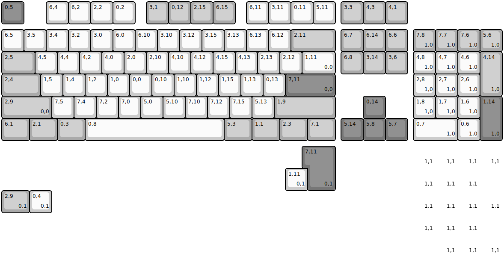
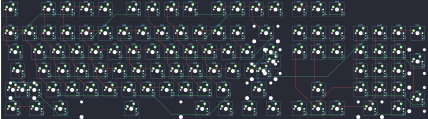

## evyd13/wasdat_code

[layout](wasdat_code-kle.json) - [PCB](wasdat_code.kicad_pcb)

{:loading="lazy"}

[Open in keyboard-layout-editor](http://www.keyboard-layout-editor.com/##@@_c=#777777;&=0,5&_x:1&c=#cccccc;&=6,4&=6,2&=2,2&=0,2&_x:0.5&c=#aaaaaa;&=3,1&=0,12&=2,15&=6,15&_x:0.5&c=#cccccc;&=6,11&=3,11&=0,11&=5,11&_x:0.25&c=#aaaaaa;&=3,3&=4,3&=4,1;&@_y:0.25&c=#cccccc;&=6,5&=3,5&=3,4&=3,2&=3,0&=6,0&=6,10&=3,10&=3,12&=3,15&=3,13&=6,13&=6,12&_c=#aaaaaa&w:2;&=2,11&_x:0.25;&=6,7&=6,14&=6,6&_x:0.25;&=7,8%0A%0A%0A1,0&=7,7%0A%0A%0A1,0&=7,6%0A%0A%0A1,0&=5,6%0A%0A%0A1,0;&@_w:1.5;&=2,5&_c=#cccccc;&=4,5&=4,4&=4,2&=4,0&=2,0&=2,10&=4,10&=4,12&=4,15&=4,13&=2,13&=2,12&_w:1.5;&=1,11%0A%0A%0A0,0&_x:0.25&c=#aaaaaa;&=6,8&=3,14&=3,6&_x:0.25&c=#cccccc;&=4,8%0A%0A%0A1,0&=4,7%0A%0A%0A1,0&=4,6%0A%0A%0A1,0&_c=#aaaaaa&h:2;&=4,14%0A%0A%0A1,0;&@_w:1.75;&=2,4&_c=#cccccc;&=1,5&=1,4&=1,2&=1,0&=0,0&=0,10&=1,10&=1,12&=1,15&=1,13&=0,13&_c=#777777&w:2.25;&=7,11%0A%0A%0A0,0&_x:3.5&c=#cccccc;&=2,8%0A%0A%0A1,0&=2,7%0A%0A%0A1,0&=2,6%0A%0A%0A1,0;&@_c=#aaaaaa&w:2.25;&=2,9%0A%0A%0A0,0&_c=#cccccc;&=7,5&=7,4&=7,2&=7,0&=5,0&=5,10&=7,10&=7,12&=7,15&=5,13&_c=#aaaaaa&w:2.75;&=1,9&_x:1.25&c=#777777;&=0,14&_x:1.25&c=#cccccc;&=1,8%0A%0A%0A1,0&=1,7%0A%0A%0A1,0&=1,6%0A%0A%0A1,0&_c=#777777&h:2;&=1,14%0A%0A%0A1,0;&@_c=#aaaaaa&w:1.25;&=6,1&_w:1.25;&=2,1&_w:1.25;&=0,3&_c=#cccccc&w:6.25;&=0,8&_c=#aaaaaa&w:1.25;&=5,3&_w:1.25;&=1,1&_w:1.25;&=2,3&_w:1.25;&=7,1&_x:0.25&c=#777777;&=5,14&=5,8&=5,7&_x:0.25&c=#cccccc&w:2;&=0,7%0A%0A%0A1,0&=0,6%0A%0A%0A1,0;&@_x:13.75&y:0.25&c=#777777&w:1.25&h:2&w2:1.5&h2:1&x2:-0.25;&=7,11%0A%0A%0A0,1&_x:3.5&c=#cccccc&d:true;&=%0A%0A%0A1,1&_d:true;&=%0A%0A%0A1,1&_d:true;&=%0A%0A%0A1,1&_d:true;&=%0A%0A%0A1,1;&@_x:12.75;&=1,11%0A%0A%0A0,1&_x:4.75&d:true;&=%0A%0A%0A1,1&_d:true;&=%0A%0A%0A1,1&_d:true;&=%0A%0A%0A1,1&_h:2&d:true;&=%0A%0A%0A1,1;&@_c=#aaaaaa&w:1.25;&=2,9%0A%0A%0A0,1&_c=#cccccc;&=0,4%0A%0A%0A0,1&_x:16.25&d:true;&=%0A%0A%0A1,1&_d:true;&=%0A%0A%0A1,1&_d:true;&=%0A%0A%0A1,1;&@_x:18.5&d:true;&=%0A%0A%0A1,1&_d:true;&=%0A%0A%0A1,1&_d:true;&=%0A%0A%0A1,1&_h:2&d:true;&=%0A%0A%0A1,1;&@_x:18.5&w:2&d:true;&=%0A%0A%0A1,1&_d:true;&=%0A%0A%0A1,1)

{:loading="lazy"}

