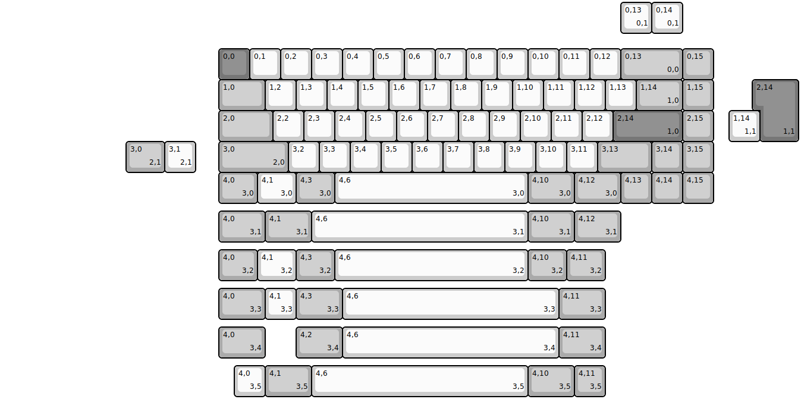
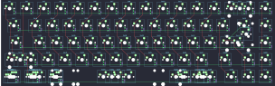
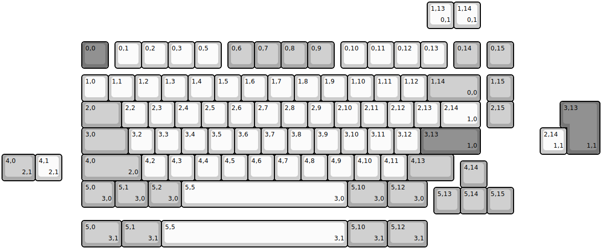
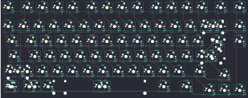
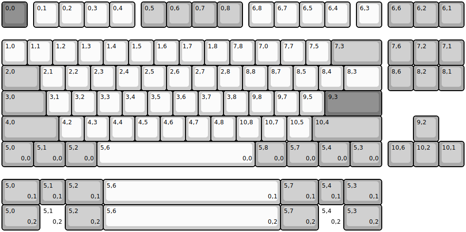
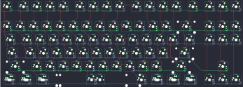
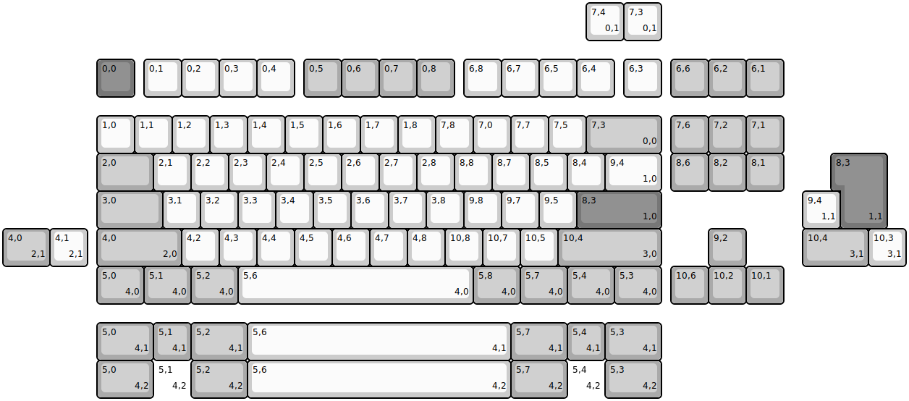
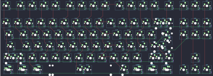

## exclusive/e65

[layout](e65-kle.json) - [PCB](e65.kicad_pcb)

{:loading="lazy"}

[Open in keyboard-layout-editor](http://www.keyboard-layout-editor.com/##@@_x:7&y:1.5&c=#777777;&=0,0&_c=#cccccc;&=0,1&=0,2&=0,3&=0,4&=0,5&=0,6&=0,7&=0,8&=0,9&=0,10&=0,11&=0,12&_c=#aaaaaa&w:2;&=0,13%0A%0A%0A0,0&=0,15;&@_x:7&w:1.5;&=1,0&_c=#cccccc;&=1,2&=1,3&=1,4&=1,5&=1,6&=1,7&=1,8&=1,9&=1,10&=1,11&=1,12&=1,13&_c=#aaaaaa&w:1.5;&=1,14%0A%0A%0A1,0&=1,15;&@_x:7&w:1.75;&=2,0&_c=#cccccc;&=2,2&=2,3&=2,4&=2,5&=2,6&=2,7&=2,8&=2,9&=2,10&=2,11&=2,12&_c=#777777&w:2.25;&=2,14%0A%0A%0A1,0&_c=#aaaaaa;&=2,15;&@_x:7.0&w:2.25;&=3,0%0A%0A%0A2,0&_c=#cccccc;&=3,2&=3,3&=3,4&=3,5&=3,6&=3,7&=3,8&=3,9&=3,10&=3,11&_c=#aaaaaa&w:1.75;&=3,13&=3,14&=3,15;&@_x:7&w:1.25;&=4,0%0A%0A%0A3,0&_c=#cccccc&w:1.25;&=4,1%0A%0A%0A3,0&_c=#aaaaaa&w:1.25;&=4,3%0A%0A%0A3,0&_c=#cccccc&w:6.25;&=4,6%0A%0A%0A3,0&_c=#aaaaaa&w:1.5;&=4,10%0A%0A%0A3,0&_w:1.5;&=4,12%0A%0A%0A3,0&=4,13&=4,14&=4,15;&@_x:20&y:-6.5&c=#cccccc;&=0,13%0A%0A%0A0,1&=0,14%0A%0A%0A0,1;&@_x:24.5&y:1.5&c=#777777&w:1.25&h:2&w2:1.5&h2:1&x2:-0.25;&=2,14%0A%0A%0A1,1;&@_x:23.5&c=#cccccc;&=1,14%0A%0A%0A1,1;&@_x:4&c=#aaaaaa&w:1.25;&=3,0%0A%0A%0A2,1&_c=#cccccc;&=3,1%0A%0A%0A2,1;&@_x:7&y:1.25&c=#aaaaaa&w:1.5;&=4,0%0A%0A%0A3,1&_w:1.5;&=4,1%0A%0A%0A3,1&_c=#cccccc&w:7;&=4,6%0A%0A%0A3,1&_c=#aaaaaa&w:1.5;&=4,10%0A%0A%0A3,1&_w:1.5;&=4,12%0A%0A%0A3,1;&@_x:7&y:0.25&w:1.25;&=4,0%0A%0A%0A3,2&_c=#cccccc&w:1.25;&=4,1%0A%0A%0A3,2&_c=#aaaaaa&w:1.25;&=4,3%0A%0A%0A3,2&_c=#cccccc&w:6.25;&=4,6%0A%0A%0A3,2&_c=#aaaaaa&w:1.25;&=4,10%0A%0A%0A3,2&_w:1.25;&=4,11%0A%0A%0A3,2;&@_x:7&y:0.25&w:1.5;&=4,0%0A%0A%0A3,3&_c=#cccccc;&=4,1%0A%0A%0A3,3&_c=#aaaaaa&w:1.5;&=4,3%0A%0A%0A3,3&_c=#cccccc&w:7;&=4,6%0A%0A%0A3,3&_c=#aaaaaa&w:1.5;&=4,11%0A%0A%0A3,3;&@_x:7&y:0.25&w:1.5;&=4,0%0A%0A%0A3,4&_x:1.0&w:1.5;&=4,2%0A%0A%0A3,4&_c=#cccccc&w:7;&=4,6%0A%0A%0A3,4&_c=#aaaaaa&w:1.5;&=4,11%0A%0A%0A3,4;&@_x:7.5&y:0.25&c=#cccccc;&=4,0%0A%0A%0A3,5&_c=#aaaaaa&w:1.5;&=4,1%0A%0A%0A3,5&_c=#cccccc&w:7;&=4,6%0A%0A%0A3,5&_c=#aaaaaa&w:1.5;&=4,10%0A%0A%0A3,5&=4,11%0A%0A%0A3,5)

{:loading="lazy"}

## exclusive/e7v1

[layout](e7v1-kle.json) - [PCB](e7v1.kicad_pcb)

{:loading="lazy"}

[Open in keyboard-layout-editor](http://www.keyboard-layout-editor.com/##@@_x:3&y:1.5&c=#777777;&=0,0&_x:0.25&c=#cccccc;&=0,1&=0,2&=0,3&=0,5&_x:0.25&c=#aaaaaa;&=0,6&=0,7&=0,8&=0,9&_x:0.25&c=#cccccc;&=0,10&=0,11&=0,12&=0,13&_x:0.25&c=#aaaaaa;&=0,14&_x:0.25;&=0,15;&@_x:3&y:0.25&c=#cccccc;&=1,0&=1,1&=1,2&=1,3&=1,4&=1,5&=1,6&=1,7&=1,8&=1,9&=1,10&=1,11&=1,12&_c=#aaaaaa&w:2;&=1,14%0A%0A%0A0,0&_x:0.25;&=1,15;&@_x:3&w:1.5;&=2,0&_c=#cccccc;&=2,2&=2,3&=2,4&=2,5&=2,6&=2,7&=2,8&=2,9&=2,10&=2,11&=2,12&=2,13&_w:1.5;&=2,14%0A%0A%0A1,0&_x:0.25&c=#aaaaaa;&=2,15;&@_x:3&w:1.75;&=3,0&_c=#cccccc;&=3,2&=3,3&=3,4&=3,5&=3,6&=3,7&=3,8&=3,9&=3,10&=3,11&=3,12&_c=#777777&w:2.25;&=3,13%0A%0A%0A1,0;&@_x:3.0&c=#aaaaaa&w:2.25;&=4,0%0A%0A%0A2,0&_c=#cccccc;&=4,2&=4,3&=4,4&=4,5&=4,6&=4,7&=4,8&=4,9&=4,10&=4,11&_c=#aaaaaa&w:1.75;&=4,13;&@_x:17.25&y:-0.75;&=4,14;&@_x:3&y:-0.25&w:1.25;&=5,0%0A%0A%0A3,0&_w:1.25;&=5,1%0A%0A%0A3,0&_w:1.25;&=5,2%0A%0A%0A3,0&_c=#cccccc&w:6.25;&=5,5%0A%0A%0A3,0&_c=#aaaaaa&w:1.5;&=5,10%0A%0A%0A3,0&_w:1.5;&=5,12%0A%0A%0A3,0;&@_x:16.25&y:-0.75;&=5,13&=5,14&=5,15;&@_x:16&y:-8.0&c=#cccccc;&=1,13%0A%0A%0A0,1&=1,14%0A%0A%0A0,1;&@_x:21.25&y:2.75&c=#777777&w:1.25&h:2&w2:1.5&h2:1&x2:-0.25;&=3,13%0A%0A%0A1,1;&@_x:20.25&c=#cccccc;&=2,14%0A%0A%0A1,1;&@_c=#aaaaaa&w:1.25;&=4,0%0A%0A%0A2,1&_c=#cccccc;&=4,1%0A%0A%0A2,1;&@_x:3&y:1.5&c=#aaaaaa&w:1.5;&=5,0%0A%0A%0A3,1&_w:1.5;&=5,1%0A%0A%0A3,1&_c=#cccccc&w:7;&=5,5%0A%0A%0A3,1&_c=#aaaaaa&w:1.5;&=5,10%0A%0A%0A3,1&_w:1.5;&=5,12%0A%0A%0A3,1)

{:loading="lazy"}

## exclusive/e85_hotswap

[layout](e85_hotswap-kle.json) - [PCB](e85_hotswap.kicad_pcb)

{:loading="lazy"}

[Open in keyboard-layout-editor](http://www.keyboard-layout-editor.com/##@@_c=#777777;&=0,0&_x:0.25&c=#cccccc;&=0,1&=0,2&=0,3&=0,4&_x:0.25&c=#aaaaaa;&=0,5&=0,6&=0,7&=0,8&_x:0.25&c=#cccccc;&=6,8&=6,7&=6,5&=6,4&_x:0.25;&=6,3&_x:0.25&c=#aaaaaa;&=6,6&=6,2&=6,1;&@_y:0.5&c=#cccccc;&=1,0&=1,1&=1,2&=1,3&=1,4&=1,5&=1,6&=1,7&=1,8&=7,8&=7,0&=7,7&=7,5&_c=#aaaaaa&w:2;&=7,3&_x:0.25;&=7,6&=7,2&=7,1;&@_w:1.5;&=2,0&_c=#cccccc;&=2,1&=2,2&=2,3&=2,4&=2,5&=2,6&=2,7&=2,8&=8,8&=8,7&=8,5&=8,4&_w:1.5;&=8,3&_x:0.25&c=#aaaaaa;&=8,6&=8,2&=8,1;&@_w:1.75;&=3,0&_c=#cccccc;&=3,1&=3,2&=3,3&=3,4&=3,5&=3,6&=3,7&=3,8&=9,8&=9,7&=9,5&_c=#777777&w:2.25;&=9,3;&@_c=#aaaaaa&w:2.25;&=4,0&_c=#cccccc;&=4,2&=4,3&=4,4&=4,5&=4,6&=4,7&=4,8&=10,8&=10,7&=10,5&_c=#aaaaaa&w:2.75;&=10,4&_x:1.25;&=9,2;&@_w:1.25;&=5,0%0A%0A%0A0,0&_w:1.25;&=5,1%0A%0A%0A0,0&_w:1.25;&=5,2%0A%0A%0A0,0&_c=#cccccc&w:6.25;&=5,6%0A%0A%0A0,0&_c=#aaaaaa&w:1.25;&=5,8%0A%0A%0A0,0&_w:1.25;&=5,7%0A%0A%0A0,0&_w:1.25;&=5,4%0A%0A%0A0,0&_w:1.25;&=5,3%0A%0A%0A0,0&_x:0.25;&=10,6&=10,2&=10,1;&@_y:0.5&w:1.5;&=5,0%0A%0A%0A0,1&=5,1%0A%0A%0A0,1&_w:1.5;&=5,2%0A%0A%0A0,1&_c=#cccccc&w:7;&=5,6%0A%0A%0A0,1&_c=#aaaaaa&w:1.5;&=5,7%0A%0A%0A0,1&=5,4%0A%0A%0A0,1&_w:1.5;&=5,3%0A%0A%0A0,1;&@_w:1.5;&=5,0%0A%0A%0A0,2&_d:true;&=5,1%0A%0A%0A0,2&_w:1.5;&=5,2%0A%0A%0A0,2&_c=#cccccc&w:7;&=5,6%0A%0A%0A0,2&_c=#aaaaaa&w:1.5;&=5,7%0A%0A%0A0,2&_d:true;&=5,4%0A%0A%0A0,2&_w:1.5;&=5,3%0A%0A%0A0,2)

{:loading="lazy"}

## exclusive/e85_soldered

[layout](e85_soldered-kle.json) - [PCB](e85_soldered.kicad_pcb)

{:loading="lazy"}

[Open in keyboard-layout-editor](http://www.keyboard-layout-editor.com/##@@_x:2.5&y:1.5&c=#777777;&=0,0&_x:0.25&c=#cccccc;&=0,1&=0,2&=0,3&=0,4&_x:0.25&c=#aaaaaa;&=0,5&=0,6&=0,7&=0,8&_x:0.25&c=#cccccc;&=6,8&=6,7&=6,5&=6,4&_x:0.25;&=6,3&_x:0.25&c=#aaaaaa;&=6,6&=6,2&=6,1;&@_x:2.5&y:0.5&c=#cccccc;&=1,0&=1,1&=1,2&=1,3&=1,4&=1,5&=1,6&=1,7&=1,8&=7,8&=7,0&=7,7&=7,5&_c=#aaaaaa&w:2;&=7,3%0A%0A%0A0,0&_x:0.25;&=7,6&=7,2&=7,1;&@_x:2.5&w:1.5;&=2,0&_c=#cccccc;&=2,1&=2,2&=2,3&=2,4&=2,5&=2,6&=2,7&=2,8&=8,8&=8,7&=8,5&=8,4&_w:1.5;&=9,4%0A%0A%0A1,0&_x:0.25&c=#aaaaaa;&=8,6&=8,2&=8,1;&@_x:2.5&w:1.75;&=3,0&_c=#cccccc;&=3,1&=3,2&=3,3&=3,4&=3,5&=3,6&=3,7&=3,8&=9,8&=9,7&=9,5&_c=#777777&w:2.25;&=8,3%0A%0A%0A1,0;&@_x:2.5&c=#aaaaaa&w:2.25;&=4,0%0A%0A%0A2,0&_c=#cccccc;&=4,2&=4,3&=4,4&=4,5&=4,6&=4,7&=4,8&=10,8&=10,7&=10,5&_c=#aaaaaa&w:2.75;&=10,4%0A%0A%0A3,0&_x:1.25;&=9,2;&@_x:2.5&w:1.25;&=5,0%0A%0A%0A4,0&_w:1.25;&=5,1%0A%0A%0A4,0&_w:1.25;&=5,2%0A%0A%0A4,0&_c=#cccccc&w:6.25;&=5,6%0A%0A%0A4,0&_c=#aaaaaa&w:1.25;&=5,8%0A%0A%0A4,0&_w:1.25;&=5,7%0A%0A%0A4,0&_w:1.25;&=5,4%0A%0A%0A4,0&_w:1.25;&=5,3%0A%0A%0A4,0&_x:0.25;&=10,6&=10,2&=10,1;&@_x:15.5&y:-8.0&c=#cccccc;&=7,4%0A%0A%0A0,1&=7,3%0A%0A%0A0,1;&@_x:22.25&y:3.0&c=#777777&w:1.25&h:2&w2:1.5&h2:1&x2:-0.25;&=8,3%0A%0A%0A1,1;&@_x:21.25&c=#cccccc;&=9,4%0A%0A%0A1,1;&@_c=#aaaaaa&w:1.25;&=4,0%0A%0A%0A2,1&_c=#cccccc;&=4,1%0A%0A%0A2,1&_x:19.0&c=#aaaaaa&w:1.75;&=10,4%0A%0A%0A3,1&_c=#cccccc;&=10,3%0A%0A%0A3,1;&@_x:2.5&y:1.5&c=#aaaaaa&w:1.5;&=5,0%0A%0A%0A4,1&=5,1%0A%0A%0A4,1&_w:1.5;&=5,2%0A%0A%0A4,1&_c=#cccccc&w:7;&=5,6%0A%0A%0A4,1&_c=#aaaaaa&w:1.5;&=5,7%0A%0A%0A4,1&=5,4%0A%0A%0A4,1&_w:1.5;&=5,3%0A%0A%0A4,1;&@_x:2.5&w:1.5;&=5,0%0A%0A%0A4,2&_d:true;&=5,1%0A%0A%0A4,2&_w:1.5;&=5,2%0A%0A%0A4,2&_c=#cccccc&w:7;&=5,6%0A%0A%0A4,2&_c=#aaaaaa&w:1.5;&=5,7%0A%0A%0A4,2&_d:true;&=5,4%0A%0A%0A4,2&_w:1.5;&=5,3%0A%0A%0A4,2)

{:loading="lazy"}

