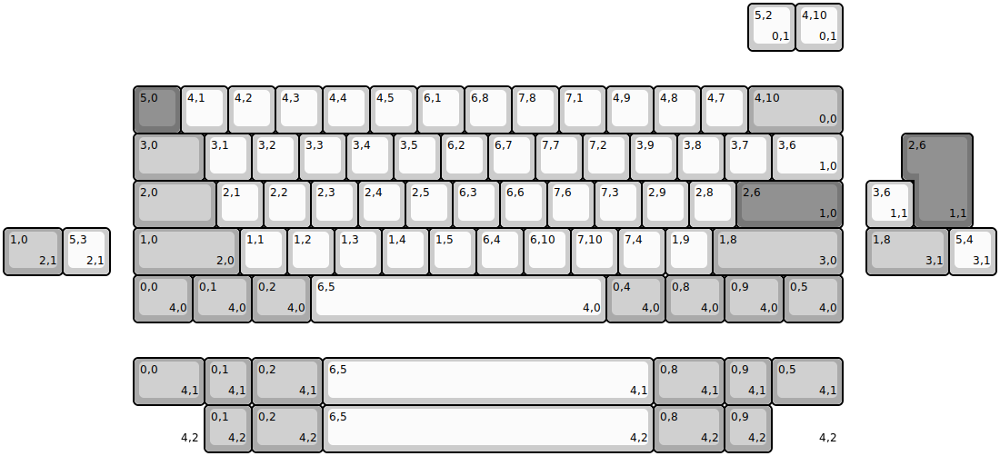
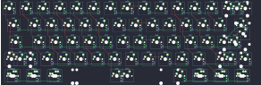
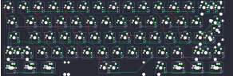

## exclusive/e6v2/le_bmc

[layout](le_bmc-kle.json) - [PCB](le_bmc.kicad_pcb)

{:loading="lazy"}

[Open in keyboard-layout-editor](http://www.keyboard-layout-editor.com/##@@_x:2.75&y:1.75&c=#777777;&=5,0&_c=#cccccc;&=4,1&=4,2&=4,3&=4,4&=4,5&=6,1&=6,8&=7,8&=7,1&=4,9&=4,8&=4,7&_c=#aaaaaa&w:2;&=4,10%0A%0A%0A0,0;&@_x:2.75&w:1.5;&=3,0&_c=#cccccc;&=3,1&=3,2&=3,3&=3,4&=3,5&=6,2&=6,7&=7,7&=7,2&=3,9&=3,8&=3,7&_w:1.5;&=3,6%0A%0A%0A1,0;&@_x:2.75&c=#aaaaaa&w:1.75;&=2,0&_c=#cccccc;&=2,1&=2,2&=2,3&=2,4&=2,5&=6,3&=6,6&=7,6&=7,3&=2,9&=2,8&_c=#777777&w:2.25;&=2,6%0A%0A%0A1,0;&@_x:2.75&c=#aaaaaa&w:2.25;&=1,0%0A%0A%0A2,0&_c=#cccccc;&=1,1&=1,2&=1,3&=1,4&=1,5&=6,4&=6,10&=7,10&=7,4&=1,9&_c=#aaaaaa&w:2.75;&=1,8%0A%0A%0A3,0;&@_x:2.75&w:1.25;&=0,0%0A%0A%0A4,0&_w:1.25;&=0,1%0A%0A%0A4,0&_w:1.25;&=0,2%0A%0A%0A4,0&_c=#cccccc&w:6.25;&=6,5%0A%0A%0A4,0&_c=#aaaaaa&w:1.25;&=0,4%0A%0A%0A4,0&_w:1.25;&=0,8%0A%0A%0A4,0&_w:1.25;&=0,9%0A%0A%0A4,0&_w:1.25;&=0,5%0A%0A%0A4,0;&@_x:15.75&y:-6.75&c=#cccccc;&=5,2%0A%0A%0A0,1&=4,10%0A%0A%0A0,1;&@_x:19.25&y:1.75&c=#777777&w:1.25&h:2&w2:1.5&h2:1&x2:-0.25;&=2,6%0A%0A%0A1,1;&@_x:18.25&c=#cccccc;&=3,6%0A%0A%0A1,1;&@_c=#aaaaaa&w:1.25;&=1,0%0A%0A%0A2,1&_c=#cccccc;&=5,3%0A%0A%0A2,1&_x:16.0&c=#aaaaaa&w:1.75;&=1,8%0A%0A%0A3,1&_c=#cccccc;&=5,4%0A%0A%0A3,1;&@_x:2.75&y:1.75&c=#aaaaaa&w:1.5;&=0,0%0A%0A%0A4,1&=0,1%0A%0A%0A4,1&_w:1.5;&=0,2%0A%0A%0A4,1&_c=#cccccc&w:7;&=6,5%0A%0A%0A4,1&_c=#aaaaaa&w:1.5;&=0,8%0A%0A%0A4,1&=0,9%0A%0A%0A4,1&_w:1.5;&=0,5%0A%0A%0A4,1;&@_x:2.75&w:1.5&d:true;&=%0A%0A%0A4,2&=0,1%0A%0A%0A4,2&_w:1.5;&=0,2%0A%0A%0A4,2&_c=#cccccc&w:7;&=6,5%0A%0A%0A4,2&_c=#aaaaaa&w:1.5;&=0,8%0A%0A%0A4,2&=0,9%0A%0A%0A4,2&_w:1.5&d:true;&=%0A%0A%0A4,2)

{:loading="lazy"}

## exclusive/e6v2/oe_bmc

[layout](oe_bmc-kle.json) - [PCB](oe_bmc.kicad_pcb)

{:loading="lazy"}

[Open in keyboard-layout-editor](http://www.keyboard-layout-editor.com/##@@_x:2.75&y:1.75&c=#777777;&=5,0&_c=#cccccc;&=4,1&=4,2&=4,3&=4,4&=4,5&=6,1&=6,8&=7,8&=7,1&=4,9&=4,8&=4,7&_c=#aaaaaa&w:2;&=4,10%0A%0A%0A0,0;&@_x:2.75&w:1.5;&=3,0&_c=#cccccc;&=3,1&=3,2&=3,3&=3,4&=3,5&=6,2&=6,7&=7,7&=7,2&=3,9&=3,8&=3,7&_w:1.5;&=3,6%0A%0A%0A1,0;&@_x:2.75&c=#aaaaaa&w:1.75;&=2,0&_c=#cccccc;&=2,1&=2,2&=2,3&=2,4&=2,5&=6,3&=6,6&=7,6&=7,3&=2,9&=2,8&_c=#777777&w:2.25;&=2,6%0A%0A%0A1,0;&@_x:2.75&c=#aaaaaa&w:2.25;&=1,0%0A%0A%0A2,0&_c=#cccccc;&=1,1&=1,2&=1,3&=1,4&=1,5&=6,4&=6,10&=7,10&=7,4&=1,9&_c=#aaaaaa&w:2.75;&=1,8%0A%0A%0A3,0;&@_x:2.75&w:1.25;&=0,0%0A%0A%0A4,0&_w:1.25;&=0,1%0A%0A%0A4,0&_w:1.25;&=0,2%0A%0A%0A4,0&_c=#cccccc&w:6.25;&=7,5%0A%0A%0A4,0&_c=#aaaaaa&w:1.25;&=0,4%0A%0A%0A4,0&_w:1.25;&=0,8%0A%0A%0A4,0&_w:1.25;&=0,9%0A%0A%0A4,0&_w:1.25;&=0,5%0A%0A%0A4,0;&@_x:15.75&y:-6.75&c=#cccccc;&=5,2%0A%0A%0A0,1&=4,10%0A%0A%0A0,1;&@_x:19.25&y:1.75&c=#777777&w:1.25&h:2&w2:1.5&h2:1&x2:-0.25;&=2,6%0A%0A%0A1,1;&@_x:18.25&c=#cccccc;&=3,6%0A%0A%0A1,1;&@_c=#aaaaaa&w:1.25;&=1,0%0A%0A%0A2,1&_c=#cccccc;&=5,3%0A%0A%0A2,1&_x:16.0&c=#aaaaaa&w:1.75;&=1,8%0A%0A%0A3,1&_c=#cccccc;&=5,4%0A%0A%0A3,1;&@_x:2.75&y:1.75&c=#aaaaaa&w:1.5;&=0,0%0A%0A%0A4,1&=0,1%0A%0A%0A4,1&_w:1.5;&=0,2%0A%0A%0A4,1&_c=#cccccc&w:7;&=7,5%0A%0A%0A4,1&_c=#aaaaaa&w:1.5;&=0,8%0A%0A%0A4,1&=0,9%0A%0A%0A4,1&_w:1.5;&=0,5%0A%0A%0A4,1;&@_x:2.75&w:1.5&d:true;&=%0A%0A%0A4,2&=0,1%0A%0A%0A4,2&_w:1.5;&=0,2%0A%0A%0A4,2&_c=#cccccc&w:7;&=7,5%0A%0A%0A4,2&_c=#aaaaaa&w:1.5;&=0,8%0A%0A%0A4,2&=0,9%0A%0A%0A4,2&_w:1.5&d:true;&=%0A%0A%0A4,2)

{:loading="lazy"}

