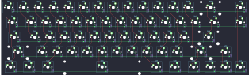

## fc660c/fc660c

[layout](fc660c-kle.json) - [PCB](fc660c.kicad_pcb)

{:loading="lazy"}

[Open in keyboard-layout-editor](http://www.keyboard-layout-editor.com/##@@_c=#777777;&=1,3&_c=#cccccc;&=1,0&=1,1&=1,2&=1,4&=1,6&=1,7&=1,5&=1,11&=1,8&=1,9&=1,10&=1,12&_c=#aaaaaa&w:2;&=1,14&_x:0.5;&=1,15;&@_w:1.5;&=0,3&_c=#cccccc;&=0,0&=0,1&=0,2&=0,4&=0,6&=0,7&=0,5&=0,11&=0,8&=0,9&=0,10&=0,12&_w:1.5;&=0,14&_x:0.5&c=#aaaaaa;&=0,15;&@_w:1.75;&=4,3&_c=#cccccc;&=4,0&=4,1&=4,2&=4,4&=4,6&=4,7&=4,5&=4,11&=4,8&=4,9&=4,10&_c=#777777&w:2.25;&=4,14;&@_c=#aaaaaa&w:2.25;&=3,3&_c=#cccccc;&=3,1&=3,2&=3,4&=3,6&=3,7&=3,5&=3,11&=3,8&=3,9&=3,10&_c=#aaaaaa&w:2.25;&=3,12&_c=#777777;&=3,13;&@_c=#aaaaaa&w:1.25;&=2,3&_w:1.25;&=2,1&_w:1.25;&=2,2&_c=#cccccc&w:6;&=2,7&_c=#aaaaaa&w:1.25;&=2,8&_w:1.25;&=2,10&_w:1.25;&=2,12&_c=#777777;&=2,14&=2,13&=2,15)

{:loading="lazy"}

