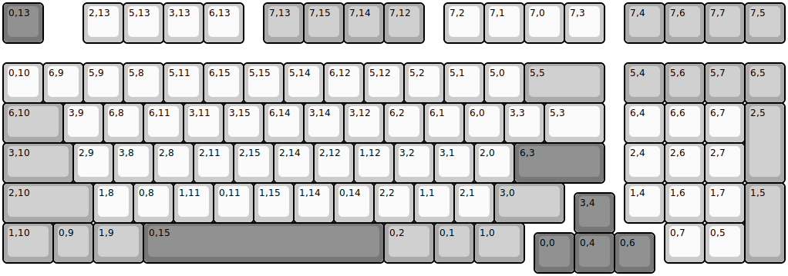
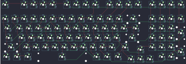

## fc980c/fc980c

[layout](fc980c-kle.json) - [PCB](fc980c.kicad_pcb)

{:loading="lazy"}

[Open in keyboard-layout-editor](http://www.keyboard-layout-editor.com/##@@_c=#777777;&=0,13&_x:1&c=#cccccc;&=2,13&=5,13&=3,13&=6,13&_x:0.5&c=#aaaaaa;&=7,13&=7,15&=7,14&=7,12&_x:0.5&c=#cccccc;&=7,2&=7,1&=7,0&=7,3&_x:0.5&c=#aaaaaa;&=7,4&=7,6&=7,7&=7,5;&@_y:0.5&c=#cccccc;&=0,10&=6,9&=5,9&=5,8&=5,11&=6,15&=5,15&=5,14&=6,12&=5,12&=5,2&=5,1&=5,0&_c=#aaaaaa&w:2;&=5,5&_x:0.5;&=5,4&=5,6&=5,7&=6,5;&@_w:1.5;&=6,10&_c=#cccccc;&=3,9&=6,8&=6,11&=3,11&=3,15&=6,14&=3,14&=3,12&=6,2&=6,1&=6,0&=3,3&_w:1.5;&=5,3&_x:0.5;&=6,4&=6,6&=6,7&_c=#aaaaaa&h:2;&=2,5;&@_w:1.75;&=3,10&_c=#cccccc;&=2,9&=3,8&=2,8&=2,11&=2,15&=2,14&=2,12&=1,12&=3,2&=3,1&=2,0&_c=#777777&w:2.25;&=6,3&_x:0.5&c=#cccccc;&=2,4&=2,6&=2,7;&@_c=#aaaaaa&w:2.25;&=2,10&_c=#cccccc;&=1,8&=0,8&=1,11&=0,11&=1,15&=1,14&=0,14&=2,2&=1,1&=2,1&_c=#aaaaaa&w:1.75;&=3,0&_x:1.5&c=#cccccc;&=1,4&=1,6&=1,7&_c=#aaaaaa&h:2;&=1,5;&@_x:14.25&y:-0.75&c=#777777;&=3,4;&@_y:-0.25&c=#aaaaaa&w:1.25;&=1,10&=0,9&_w:1.25;&=1,9&_c=#777777&w:6;&=0,15&_c=#aaaaaa&w:1.25;&=0,2&=0,1&_w:1.25;&=1,0&_x:3.5&c=#cccccc;&=0,7&=0,5;&@_x:13.25&y:-0.75&c=#777777;&=0,0&=0,4&=0,6)

{:loading="lazy"}

