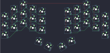

## ferris/sweep

[layout](sweep-kle.json) - [PCB](sweep.kicad_pcb)

{:loading="lazy"}

[Open in keyboard-layout-editor](http://www.keyboard-layout-editor.com/##@@_x:2;&=0,2&_x:5.75;&=4,2;&@_x:1&y:-0.5;&=0,1&_x:1;&=0,3&_x:3.75;&=4,1&_x:1.0;&=4,3;&@_x:4&y:-0.75;&=0,4&_x:1.75;&=4,0;&@_x:2&y:-0.75;&=1,2&_x:5.75;&=5,2;&@_y:-0.75;&=0,0&_x:9.75;&=4,4;&@_x:1&y:-0.75;&=1,1&_x:1;&=1,3&_x:3.75;&=5,1&_x:1.0;&=5,3;&@_x:4&y:-0.75;&=1,4&_x:1.75;&=5,0;&@_x:2&y:-0.75;&=2,2&_x:5.75;&=6,2;&@_y:-0.75;&=1,0&_x:9.75;&=5,4;&@_x:1&y:-0.75;&=2,1&_x:1;&=2,3&_x:3.75;&=6,1&_x:1.0;&=6,3;&@_x:4&y:-0.75;&=2,4&_x:1.75;&=6,0;&@_y:-0.5;&=2,0&_x:9.75;&=6,4;&@_r:15&x:4.67&y:-1.51;&=3,0;&@_r:30&x:6.5&y:-2.49;&=3,1;&@_r:-30&x:2.76&y:4.92;&=7,0;&@_r:-15&x:5.75&y:-2.42;&=7,1)

{:loading="lazy"}

