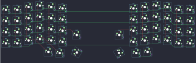

## ffkeebs/siris

[layout](siris-kle.json) - [PCB](siris.kicad_pcb)

{:loading="lazy"}

[Open in keyboard-layout-editor](http://www.keyboard-layout-editor.com/##@@_x:3.5&c=#aaaaaa;&=0,3&_x:9.25;&=0,8;&@_x:2.5&y:-0.875;&=0,2&_x:1.0;&=0,4;&@_x:12.75&y:-0.995;&=0,7&_x:1.0;&=0,9;&@_x:5.5&y:-0.88;&=0,5&_x:5.25;&=0,6;&@_x:1.5&y:-0.875;&=0,1;&@_x:0.5&y:-0.995&c=#777777;&=0,0&_x:14.25&c=#aaaaaa;&=0,10&=0,11;&@_x:3.5&y:-0.38&c=#cccccc;&=1,3&_x:9.25;&=1,8;&@_x:2.5&y:-0.875;&=1,2&_x:1.0;&=1,4;&@_x:12.75&y:-0.995;&=1,7&_x:1.0;&=1,9;&@_x:5.5&y:-0.88;&=1,5&_x:5.25;&=1,6;&@_x:1.5&y:-0.875;&=1,1;&@_x:0.5&y:-0.995&c=#aaaaaa;&=1,0&_x:14.25&c=#cccccc;&=1,10&_c=#aaaaaa;&=1,11;&@_x:3.5&y:-0.38&c=#cccccc;&=2,3&_x:9.25;&=2,8;&@_x:2.5&y:-0.875;&=2,2&_x:1.0;&=2,4;&@_x:12.75&y:-0.995;&=2,7&_x:1.0;&=2,9;&@_x:5.5&y:-0.88;&=2,5&_x:5.25;&=2,6;&@_x:1.5&y:-0.875;&=2,1;&@_x:0.5&y:-0.995&c=#aaaaaa;&=2,0&_x:14.25&c=#cccccc;&=2,10&_c=#aaaaaa;&=2,11;&@_x:6.75&y:-0.75;&=4,5&_x:2.75;&=4,6;&@_x:3.5&y:-0.63&c=#cccccc;&=3,3&_x:9.25;&=3,8;&@_x:2.5&y:-0.875;&=3,2&_x:1.0;&=3,4;&@_x:12.75&y:-0.995;&=3,7&_x:1.0;&=3,9;&@_x:5.5&y:-0.88;&=3,5&_x:5.25;&=3,6;&@_x:1.5&y:-0.875;&=3,1;&@_x:0.5&y:-0.995&c=#aaaaaa;&=3,0&_x:14.25&c=#cccccc;&=3,10&_c=#aaaaaa;&=3,11;&@_x:4.25&y:-0.23;&=4,2&_x:7.75;&=4,0;&@_x:5.25&y:-0.9;&=4,3&_x:5.75;&=4,8;&@_r:60&rx:9.25&ry:3.25&x:1.4&y:-1.25&w:1.5;&=4,7;&@_r:-60&x:-3.0&y:-1.25&w:1.5;&=4,4)

{:loading="lazy"}

