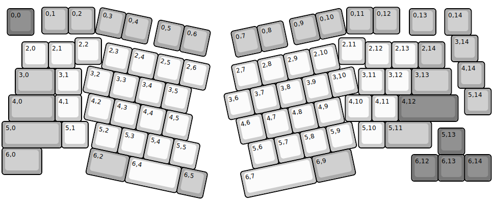
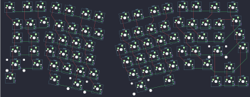

## floookay/adelheid

[layout](adelheid-kle.json) - [PCB](adelheid.kicad_pcb)

{:loading="lazy"}

[Open in keyboard-layout-editor](http://www.keyboard-layout-editor.com/##@@_x:1.5&y:0.2&c=#aaaaaa;&=0,1&_x:11.5;&=0,12;&@_x:0.2&y:-0.95&c=#777777;&=0,0&_x:14.165&c=#aaaaaa;&=0,13&_x:0.335;&=0,14;&@_x:16.95;&=3,14;&@_x:0.75&y:-0.75&c=#cccccc;&=2,0&=2,1&_x:10.95;&=2,12&=2,13&_c=#aaaaaa;&=2,14;&@_x:17.2&y:-0.25;&=4,14;&@_x:0.5&y:-0.75&w:1.5;&=3,0&_c=#cccccc;&=3,1&_x:10.45;&=3,11&=3,12&_c=#aaaaaa&w:1.5;&=3,13;&@_x:17.45&y:-0.25;&=5,14;&@_x:0.25&y:-0.75&w:1.75;&=4,0&_c=#cccccc;&=4,1&_x:9.95;&=4,10&=4,11&_c=#777777&w:2.25;&=4,12;&@_c=#aaaaaa&w:2.25;&=5,0&_c=#cccccc;&=5,1&_x:10.2;&=5,10&_c=#aaaaaa&w:1.75;&=5,11;&@_x:16.45&y:-0.75&c=#777777;&=5,13;&@_y:-0.25&c=#aaaaaa&w:1.5;&=6,0;&@_x:15.45&y:-0.75&c=#777777;&=6,12&=6,13&=6,14;&@_rx:10&x:-7.5&y:0.2&c=#aaaaaa;&=0,2&_x:9.5;&=0,11;&@_x:-7.25&y:0.15&c=#cccccc;&=2,2&_x:8.95;&=2,11;&@_r:12&rx:8.5&ry:3.5&x:-5.35&y:-2.25&c=#aaaaaa;&=0,3&=0,4&_x:0.25;&=0,5&=0,6;&@_x:-4.85&y:0.25&c=#cccccc;&=2,3&=2,4&=2,5&=2,6;&@_x:-5.35;&=3,2&=3,3&=3,4&=3,5;&@_x:-5.1;&=4,2&=4,3&=4,4&=4,5;&@_x:-4.6;&=5,2&=5,3&=5,4&=5,5;&@_x:-4.6&c=#aaaaaa&w:1.5;&=6,2&_c=#cccccc&p=SPACE&w:2;&=6,4&_c=#aaaaaa;&=6,5;&@_r:-12&ry:3.25&x:3.8&y:-2.05;&=0,10&_x:-4.25;&=0,7&=0,8&_x:0.25;&=0,9;&@_x:0.3&y:0.25&c=#cccccc;&=2,7&=2,8&=2,9&=2,10;&@_x:-0.2;&=3,6&=3,7&=3,8&=3,9&=3,10;&@_x:0.05;&=4,6&=4,7&=4,8&=4,9;&@_x:0.3;&=5,6&=5,7&=5,8&=5,9;&@_x:-0.2&w:2.75;&=6,7&_c=#aaaaaa&w:1.5;&=6,9)

{:loading="lazy"}

