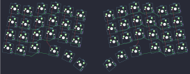

## foostan/cornelius

[layout](cornelius-kle.json) - [PCB](cornelius.kicad_pcb)

{:loading="lazy"}

[Open in keyboard-layout-editor](http://www.keyboard-layout-editor.com/##@@_r:10&rx:1.5&x:2.5;&=0,3;&@_x:3.5&y:-0.875;&=0,4;&@_x:1.5&y:-0.875;&=0,2&_x:2.0;&=0,5;&@_x:-0.5&y:-0.625;&=0,0&=0,1;&@_x:2.5&y:-0.625;&=1,3;&@_x:3.5&y:-0.875;&=1,4;&@_x:1.5&y:-0.875;&=1,2&_x:2.0;&=1,5;&@_x:-0.5&y:-0.625;&=1,0&=1,1;&@_x:2.5&y:-0.625;&=2,3;&@_x:3.5&y:-0.875;&=2,4;&@_x:1.5&y:-0.875;&=2,2&_x:2.0;&=2,5;&@_x:-0.5&y:-0.625;&=2,0&=2,1;&@_x:1.5&y:-0.375;&=3,2&_x:0.5;&=3,3;&@_x:-0.5&y:-0.625;&=3,0&=3,1;&@_r:25&x:4.97&y:-2.515;&=3,4;&@_r:40&x:6.55&y:-2.6;&=3,5;&@_r:-40&rx:13.25&x:-7.55&y:0.51;&=3,6;&@_r:-25&x:-5.97&y:0.6;&=3,7;&@_r:-10&x:-3.5&y:-3.11;&=0,8;&@_x:-4.5&y:-0.875;&=0,7;&@_x:-5.5&y:-0.875;&=0,6&_x:2.0;&=0,9;&@_x:-1.5&y:-0.625;&=0,10&=0,11;&@_x:-3.5&y:-0.625;&=1,8;&@_x:-4.5&y:-0.875;&=1,7;&@_x:-5.5&y:-0.875;&=1,6&_x:2.0;&=1,9;&@_x:-1.5&y:-0.625;&=1,10&=1,11;&@_x:-3.5&y:-0.625;&=2,8;&@_x:-4.5&y:-0.875;&=2,7;&@_x:-5.5&y:-0.875;&=2,6&_x:2.0;&=2,9;&@_x:-1.5&y:-0.625;&=2,10&=2,11;&@_x:-4.0&y:-0.375;&=3,8&_x:0.5;&=3,9;&@_x:-1.5&y:-0.625;&=3,10&=3,11)

{:loading="lazy"}

