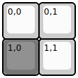
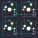

## frooastboard/nano

[layout](nano-kle.json) - [PCB](nano.kicad_pcb)

{:loading="lazy"}

[Open in keyboard-layout-editor](http://www.keyboard-layout-editor.com/##@@=0,0&=0,1;&@_c=#777777;&=1,0&_c=#cccccc;&=1,1)

{:loading="lazy"}

