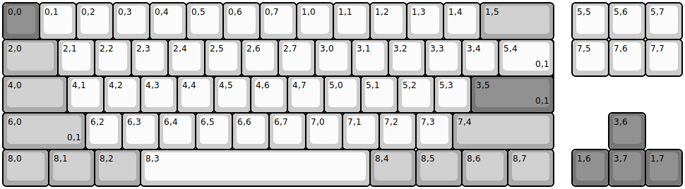
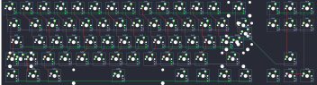

## frooastboard/walnut

[layout](walnut-kle.json) - [PCB](walnut.kicad_pcb)

{:loading="lazy"}

[Open in keyboard-layout-editor](http://www.keyboard-layout-editor.com/##@@_c=#777777;&=0,0&_c=#cccccc;&=0,1&=0,2&=0,3&=0,4&=0,5&=0,6&=0,7&=1,0&=1,1&=1,2&=1,3&=1,4&_c=#aaaaaa&w:2;&=1,5&_x:0.5&c=#cccccc;&=5,5&=5,6&=5,7;&@_c=#aaaaaa&w:1.5;&=2,0&_c=#cccccc;&=2,1&=2,2&=2,3&=2,4&=2,5&=2,6&=2,7&=3,0&=3,1&=3,2&=3,3&=3,4&_x:0.25&c=#777777&w:1.25&h:2&w2:1.5&h2:1&x2:-0.25;&=3,5%0A%0A%0A0,0&_x:0.5&c=#cccccc;&=7,5&=7,6&=7,7;&@_c=#aaaaaa&w:1.75;&=4,0&_c=#cccccc;&=4,1&=4,2&=4,3&=4,4&=4,5&=4,6&=4,7&=5,0&=5,1&=5,2&=5,3&=5,4%0A%0A%0A0,0;&@_c=#aaaaaa&w:1.25;&=6,0%0A%0A%0A0,0&_c=#cccccc;&=6,1%0A%0A%0A0,0&=6,2&=6,3&=6,4&=6,5&=6,6&=6,7&=7,0&=7,1&=7,2&=7,3&_c=#aaaaaa&w:2.75;&=7,4&_x:1.5&c=#777777;&=3,6;&@_c=#aaaaaa&w:1.25;&=8,0&_w:1.25;&=8,1&_w:1.25;&=8,2&_c=#cccccc&w:6.25;&=8,3&_c=#aaaaaa&w:1.25;&=8,4&_w:1.25;&=8,5&_w:1.25;&=8,6&_w:1.25;&=8,7&_x:0.5&c=#777777;&=1,6&=3,7&=1,7;&@_x:13.5&y:-4&c=#cccccc&w:1.5;&=5,4%0A%0A%0A0,1;&@_x:12.75&c=#777777&w:2.25;&=3,5%0A%0A%0A0,1;&@_c=#aaaaaa&w:2.25;&=6,0%0A%0A%0A0,1)

{:loading="lazy"}

