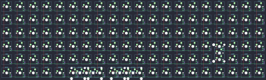

## fruit/bop

[layout](bop-kle.json) - [PCB](bop.kicad_pcb)

{:loading="lazy"}

[Open in keyboard-layout-editor](http://www.keyboard-layout-editor.com/##@@=0,0&=0,1&=0,2&=0,3&=0,4&=0,5&=0,6&=0,7&=0,8&=0,9&=0,10&=0,11&=0,12&=0,13&=0,14&=0,15&=0,16&=0,17&=0,18&=0,19;&@=1,0&=1,1&=1,2&=1,3&=1,4&=1,5&=1,6&=1,7&=1,8&=1,9&=1,10&=1,11&=1,12&=1,13&=1,14&=1,15&=1,16&=1,17&=1,18&=1,19;&@=2,0&=2,1&=2,2&=2,3&=2,4&=2,5&=2,6&=2,7&=2,8&=2,9&=2,10&=2,11&=2,12&=2,13&=2,14&=2,15&=2,16&=2,17&=2,18&=2,19;&@=3,0&=3,1&=3,2&=3,3&=3,4&=3,5&=3,6&=3,7&=3,8&=3,9&=3,10&=3,11&=3,12&=3,13&=3,14&=3,15&=3,16%0A%0A%0A0,0&=3,17&=3,18&=3,19;&@=4,0&=4,1&=4,2&=4,3&=4,4&=4,5&=4,6&=4,7&=4,8&=4,9&=4,10&=4,11&=4,12&=4,13&=4,14&=4,15&=4,16%0A%0A%0A0,0&=4,17&=4,18&=4,19;&@=5,0&=5,1&=5,2&=5,3&=5,4&=5,5%0A%0A%0A1,0&=5,6%0A%0A%0A1,0&=5,7%0A%0A%0A1,0&=5,8%0A%0A%0A1,0&=5,9%0A%0A%0A1,0&=5,10%0A%0A%0A1,0&=5,11&=5,12&=5,13&=5,14&=5,15&=5,16&=5,17&=5,18&=5,19;&@_x:21&y:-3&h:2;&=3,16%0A%0A%0A0,1;&@_x:5&y:3&w:2;&=5,5%0A%0A%0A1,2&=5,7%0A%0A%0A1,2&_w:2;&=5,8%0A%0A%0A1,2&=5,10%0A%0A%0A1,2;&@_x:5&y:0.25;&=5,5%0A%0A%0A1,1&_w:2;&=5,6%0A%0A%0A1,1&=5,8%0A%0A%0A1,1&_w:2;&=5,9%0A%0A%0A1,1)

{:loading="lazy"}

