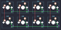

## geekboards/macropad_v2

[layout](macropad_v2-kle.json) - [PCB](macropad_v2.kicad_pcb)

{:loading="lazy"}

[Open in keyboard-layout-editor](http://www.keyboard-layout-editor.com/##@@=0,0&=0,1&=0,2&=0,3;&@=1,0&=1,1&=1,2&=1,3)

{:loading="lazy"}

