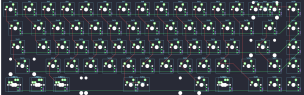
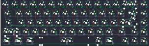
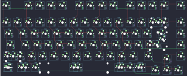
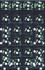

## ghs/jem_hotswap_ansi

[layout](jem_hotswap_ansi-kle.json) - [PCB](jem_hotswap_ansi.kicad_pcb)

{:loading="lazy"}

[Open in keyboard-layout-editor](http://www.keyboard-layout-editor.com/##@@_c=#777777;&=0,0&_c=#cccccc;&=0,1&=0,2&=0,3&=0,4&=0,5&=0,6&=0,7&=0,8&=0,9&=0,10&=0,11&=0,12&_c=#aaaaaa&w:2;&=0,13%0A%0A%0A0,0&=1,14;&@_w:1.5;&=1,0&_c=#cccccc;&=1,1&=1,2&=1,3&=1,4&=1,5&=1,6&=1,7&=1,8&=1,9&=1,10&=1,11&=1,12&_w:1.5;&=1,13&_c=#aaaaaa;&=2,14;&@_w:1.75;&=2,0&_c=#cccccc;&=2,1&=2,2&=2,3&=2,4&=2,5&=2,6&=2,7&=2,8&=2,9&=2,10&=2,11&_c=#777777&w:2.25;&=2,13&_c=#aaaaaa;&=3,14;&@_w:2.25;&=3,0&_c=#cccccc;&=3,2&=3,3&=3,4&=3,5&=3,6&=3,7&=3,8&=3,9&=3,10&=3,11&_c=#aaaaaa&w:1.75;&=3,12&_c=#777777;&=3,13&_c=#aaaaaa;&=4,14;&@_w:1.25;&=4,0%0A%0A%0A1,0&_w:1.25;&=4,1%0A%0A%0A1,0&_w:1.25;&=4,2%0A%0A%0A1,0&_c=#cccccc&w:6.25;&=4,6%0A%0A%0A1,0&_c=#aaaaaa&w:1.25;&=4,9%0A%0A%0A1,0&_w:1.25;&=4,10%0A%0A%0A1,0&_x:0.5&c=#777777;&=4,11&=4,12&=4,13;&@_x:16.75&y:-5&c=#aaaaaa;&=0,13%0A%0A%0A0,1&=0,14%0A%0A%0A0,1;&@_y:4.25&w:1.5;&=4,0%0A%0A%0A1,1&=4,1%0A%0A%0A1,1&_w:1.5;&=4,2%0A%0A%0A1,1&_c=#cccccc&w:7;&=4,6%0A%0A%0A1,1&_c=#aaaaaa&w:1.5;&=4,10%0A%0A%0A1,1)

{:loading="lazy"}

## ghs/jem_soldered

[layout](jem_soldered-kle.json) - [PCB](jem_soldered.kicad_pcb)

{:loading="lazy"}

[Open in keyboard-layout-editor](http://www.keyboard-layout-editor.com/##@@_c=#777777;&=0,0&_c=#cccccc;&=0,1&=0,2&=0,3&=0,4&=0,5&=0,6&=0,7&=0,8&=0,9&=0,10&=0,11&=0,12&_c=#aaaaaa&w:2;&=0,13%0A%0A%0A0,0&=1,14;&@_w:1.5;&=1,0&_c=#cccccc;&=1,1&=1,2&=1,3&=1,4&=1,5&=1,6&=1,7&=1,8&=1,9&=1,10&=1,11&=1,12&_w:1.5;&=1,13%0A%0A%0A1,0&_c=#aaaaaa;&=2,14;&@_w:1.75;&=2,0&_c=#cccccc;&=2,1&=2,2&=2,3&=2,4&=2,5&=2,6&=2,7&=2,8&=2,9&=2,10&=2,11&_c=#777777&w:2.25;&=2,13%0A%0A%0A1,0&_c=#aaaaaa;&=3,14;&@_w:2.25;&=3,0%0A%0A%0A2,0&_c=#cccccc;&=3,2&=3,3&=3,4&=3,5&=3,6&=3,7&=3,8&=3,9&=3,10&=3,11&_c=#aaaaaa&w:1.75;&=3,12&_c=#777777;&=3,13&_c=#aaaaaa;&=4,14;&@_w:1.25;&=4,0%0A%0A%0A3,0&_w:1.25;&=4,1%0A%0A%0A3,0&_w:1.25;&=4,2%0A%0A%0A3,0&_c=#cccccc&w:6.25;&=4,6%0A%0A%0A3,0&_c=#aaaaaa&w:1.25;&=4,9%0A%0A%0A3,0&_w:1.25;&=4,10%0A%0A%0A3,0&_x:0.5&c=#777777;&=4,11&=4,12&=4,13;&@_x:16.75&y:-5&c=#aaaaaa;&=0,13%0A%0A%0A0,1&=0,14%0A%0A%0A0,1;&@_x:17.5&c=#777777&w:1.25&h:2&w2:1.5&h2:1&x2:-0.25;&=1,13%0A%0A%0A1,1;&@_x:16.5&c=#cccccc;&=2,13%0A%0A%0A1,1;&@_y:2.25&c=#aaaaaa&w:1.25;&=3,0%0A%0A%0A2,1&=3,1%0A%0A%0A2,1;&@_w:1.5;&=4,0%0A%0A%0A3,1&=4,1%0A%0A%0A3,1&_w:1.5;&=4,2%0A%0A%0A3,1&_c=#cccccc&w:7;&=4,6%0A%0A%0A3,1&_c=#aaaaaa&w:1.5;&=4,10%0A%0A%0A3,1)

{:loading="lazy"}

## ghs/rar

[layout](rar-kle.json) - [PCB](rar.kicad_pcb)

{:loading="lazy"}

[Open in keyboard-layout-editor](http://www.keyboard-layout-editor.com/##@@_x:2.5&c=#777777;&=0,0&_x:1.0&c=#aaaaaa;&=0,1&=1,1&=0,2&=1,2&_x:0.5&c=#777777;&=0,3&=1,3&=0,4&=1,4&_x:0.5&c=#aaaaaa;&=1,5&=0,6&=1,6&=0,7&_x:0.5&c=#777777;&=1,7;&@_x:2.5&y:0.5&c=#cccccc;&=2,0&=3,0&=2,1&=3,1&=2,2&=3,2&=2,3&=3,3&=2,4&=3,4&=2,5&=3,5&=2,6&_c=#aaaaaa&w:2;&=3,6%0A%0A%0A0,0&_x:0.5;&=3,7;&@_x:2.5&w:1.5;&=4,0&_c=#cccccc;&=5,0&=4,1&=5,1&=4,2&=5,2&=4,3&=5,3&=4,4&=5,4&=4,5&=5,5&=4,6&_w:1.5;&=4,7%0A%0A%0A1,0&_x:0.5&c=#aaaaaa;&=5,7;&@_x:2.5&w:1.75;&=6,0&_c=#cccccc;&=7,0&=6,1&=7,1&=6,2&=7,2&=6,3&=7,3&=6,4&=7,4&=6,5&=7,5&_c=#777777&w:2.25;&=7,6%0A%0A%0A1,0&_x:0.5&c=#aaaaaa;&=7,7;&@_x:2.5&w:2.25;&=8,0%0A%0A%0A2,0&_c=#cccccc;&=8,1&=9,1&=8,2&=9,2&=8,3&=9,3&=8,4&=9,4&=8,5&=9,5&_c=#aaaaaa&w:1.75;&=8,6&_x:1.5;&=9,7;&@_x:16.75&y:-0.75&c=#777777;&=8,7;&@_x:2.5&y:-0.25&c=#aaaaaa&w:1.25;&=10,0%0A%0A%0A3,0&_w:1.25;&=11,0%0A%0A%0A3,0&_w:1.25;&=10,1%0A%0A%0A3,0&_c=#cccccc&w:6.25;&=10,3%0A%0A%0A3,0&_c=#aaaaaa&w:1.5;&=10,5%0A%0A%0A4,0&_w:1.5;&=10,6%0A%0A%0A4,0;&@_x:15.75&y:-0.75&c=#777777;&=11,6&=10,7&=11,7;&@_x:19.5&y:-5.25&c=#aaaaaa;&=3,6%0A%0A%0A0,1&=2,7%0A%0A%0A0,1;&@_x:20.25&c=#777777&w:1.25&h:2&w2:1.5&h2:1&x2:-0.25;&=4,7%0A%0A%0A1,1;&@_x:19.25&c=#cccccc;&=7,6%0A%0A%0A1,1;&@_c=#aaaaaa&w:1.25;&=8,0%0A%0A%0A2,1&_c=#cccccc;&=9,0%0A%0A%0A2,1;&@_x:2.5&y:1.5&c=#aaaaaa&w:1.5;&=10,0%0A%0A%0A3,1&_w:1.5;&=11,0%0A%0A%0A3,1&_c=#cccccc&w:7;&=10,3%0A%0A%0A3,1&_c=#aaaaaa;&=10,5%0A%0A%0A4,1&=11,5%0A%0A%0A4,1&=10,6%0A%0A%0A4,1)

{:loading="lazy"}

## ghs/xls

[layout](xls-kle.json) - [PCB](xls.kicad_pcb)

{:loading="lazy"}

[Open in keyboard-layout-editor](http://www.keyboard-layout-editor.com/##@@_c=#777777;&=0,0%0A%0A%0A0,0&=0,1%0A%0A%0A1,0&=0,2%0A%0A%0A2,0&=0,3%0A%0A%0A3,0;&@_y:0.25&c=#aaaaaa;&=1,0%0A%0A%0A4,0&=1,1%0A%0A%0A4,0&=1,2%0A%0A%0A4,0&=1,3%0A%0A%0A4,0;&@_c=#cccccc;&=2,0%0A%0A%0A4,0&=2,1%0A%0A%0A4,0&=2,2%0A%0A%0A4,0&_c=#aaaaaa&h:2;&=2,3%0A%0A%0A4,0;&@_c=#cccccc;&=3,0%0A%0A%0A4,0&=3,1%0A%0A%0A4,0&=3,2%0A%0A%0A4,0;&@=4,0%0A%0A%0A4,0&=4,1%0A%0A%0A4,0&=4,2%0A%0A%0A4,0&_c=#aaaaaa&h:2;&=4,3%0A%0A%0A4,0;&@_c=#cccccc&w:2;&=5,1%0A%0A%0A4,0&=5,2%0A%0A%0A4,0;&@_x:4.25&y:-6.25&c=#777777;&=0,0%0A%0A%0A0,1%0A%0A%0A%0A%0A%0Ae0&=0,1%0A%0A%0A1,1%0A%0A%0A%0A%0A%0Ae1&=0,2%0A%0A%0A2,1%0A%0A%0A%0A%0A%0Ae2&=0,3%0A%0A%0A3,1%0A%0A%0A%0A%0A%0Ae3;&@_x:4.25&y:0.25&c=#aaaaaa;&=1,0%0A%0A%0A4,1&=1,1%0A%0A%0A4,1&=1,2%0A%0A%0A4,1&=1,3%0A%0A%0A4,1&_x:0.25&c=#cccccc;&=1,0%0A%0A%0A4,2&=1,1%0A%0A%0A4,2&=1,2%0A%0A%0A4,2&=1,3%0A%0A%0A4,2;&@_x:4.25&c=#aaaaaa&h:2;&=2,0%0A%0A%0A4,1&_c=#cccccc;&=2,1%0A%0A%0A4,1&=2,2%0A%0A%0A4,1&=2,3%0A%0A%0A4,1&_x:0.25;&=2,0%0A%0A%0A4,2&=2,1%0A%0A%0A4,2&=2,2%0A%0A%0A4,2&=2,3%0A%0A%0A4,2;&@_x:5.25;&=3,1%0A%0A%0A4,1&=3,2%0A%0A%0A4,1&=3,3%0A%0A%0A4,1&_x:0.25;&=3,0%0A%0A%0A4,2&=3,1%0A%0A%0A4,2&=3,2%0A%0A%0A4,2&=3,3%0A%0A%0A4,2;&@_x:4.25&c=#aaaaaa&h:2;&=5,0%0A%0A%0A4,1&_c=#cccccc;&=4,1%0A%0A%0A4,1&=4,2%0A%0A%0A4,1&=4,3%0A%0A%0A4,1&_x:0.25;&=4,0%0A%0A%0A4,2&=4,1%0A%0A%0A4,2&=4,2%0A%0A%0A4,2&=4,3%0A%0A%0A4,2;&@_x:5.25;&=5,1%0A%0A%0A4,1&_w:2;&=5,2%0A%0A%0A4,1&_x:0.25;&=5,0%0A%0A%0A4,2&=5,1%0A%0A%0A4,2&=5,2%0A%0A%0A4,2&=5,3%0A%0A%0A4,2)

{:loading="lazy"}

