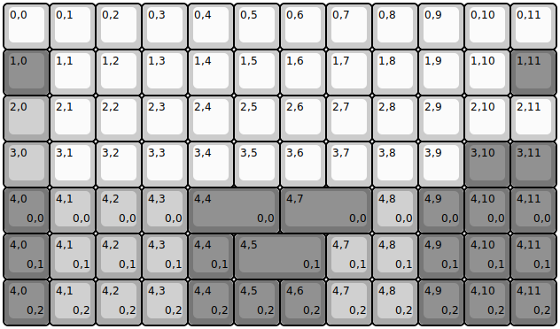
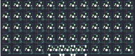

## gizmo_engineering/gk6

[layout](gk6-kle.json) - [PCB](gk6.kicad_pcb)

{:loading="lazy"}

[Open in keyboard-layout-editor](http://www.keyboard-layout-editor.com/##@@=0,0&=0,1&=0,2&=0,3&=0,4&=0,5&=0,6&=0,7&=0,8&=0,9&=0,10&=0,11;&@_c=#777777;&=1,0&_c=#cccccc;&=1,1&=1,2&=1,3&=1,4&=1,5&=1,6&=1,7&=1,8&=1,9&=1,10&_c=#777777;&=1,11;&@_c=#aaaaaa;&=2,0&_c=#cccccc;&=2,1&=2,2&=2,3&=2,4&=2,5&=2,6&=2,7&=2,8&=2,9&=2,10&=2,11;&@_c=#aaaaaa;&=3,0&_c=#cccccc;&=3,1&=3,2&=3,3&=3,4&=3,5&=3,6&=3,7&=3,8&=3,9&_c=#777777;&=3,10&=3,11;&@=4,0%0A%0A%0A0,0&_c=#aaaaaa;&=4,1%0A%0A%0A0,0&=4,2%0A%0A%0A0,0&=4,3%0A%0A%0A0,0&_c=#777777&w:2;&=4,4%0A%0A%0A0,0&_w:2;&=4,7%0A%0A%0A0,0&_c=#aaaaaa;&=4,8%0A%0A%0A0,0&_c=#777777;&=4,9%0A%0A%0A0,0&=4,10%0A%0A%0A0,0&=4,11%0A%0A%0A0,0;&@=4,0%0A%0A%0A0,1&_c=#aaaaaa;&=4,1%0A%0A%0A0,1&=4,2%0A%0A%0A0,1&=4,3%0A%0A%0A0,1&_c=#777777;&=4,4%0A%0A%0A0,1&_w:2;&=4,5%0A%0A%0A0,1&_c=#aaaaaa;&=4,7%0A%0A%0A0,1&=4,8%0A%0A%0A0,1&_c=#777777;&=4,9%0A%0A%0A0,1&=4,10%0A%0A%0A0,1&=4,11%0A%0A%0A0,1;&@=4,0%0A%0A%0A0,2&_c=#aaaaaa;&=4,1%0A%0A%0A0,2&=4,2%0A%0A%0A0,2&=4,3%0A%0A%0A0,2&_c=#777777;&=4,4%0A%0A%0A0,2&=4,5%0A%0A%0A0,2&=4,6%0A%0A%0A0,2&_c=#aaaaaa;&=4,7%0A%0A%0A0,2&=4,8%0A%0A%0A0,2&_c=#777777;&=4,9%0A%0A%0A0,2&=4,10%0A%0A%0A0,2&=4,11%0A%0A%0A0,2)

{:loading="lazy"}

