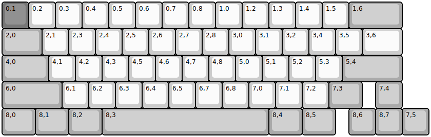
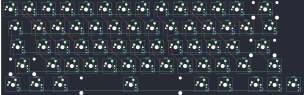

## gl516/xr63gl

[layout](xr63gl-kle.json) - [PCB](xr63gl.kicad_pcb)

{:loading="lazy"}

[Open in keyboard-layout-editor](http://www.keyboard-layout-editor.com/##@@_c=#777777;&=0,1&_c=#cccccc;&=0,2&=0,3&=0,4&=0,5&=0,6&=0,7&=0,8&=1,0&=1,2&=1,3&=1,4&=1,5&_c=#aaaaaa&w:2;&=1,6;&@_w:1.5;&=2,0&_c=#cccccc;&=2,1&=2,3&=2,4&=2,5&=2,6&=2,7&=2,8&=3,0&=3,1&=3,2&=3,4&=3,5&_w:1.5;&=3,6;&@_c=#aaaaaa&w:1.75;&=4,0&_c=#cccccc;&=4,1&=4,2&=4,3&=4,5&=4,6&=4,7&=4,8&=5,0&=5,1&=5,2&=5,3&_c=#aaaaaa&w:2.25;&=5,4;&@_w:2.25;&=6,0&_c=#cccccc;&=6,1&=6,2&=6,3&=6,4&=6,5&=6,7&=6,8&=7,0&=7,1&=7,2&_c=#aaaaaa&w:1.25;&=7,3&_x:0.5;&=7,4;&@_w:1.25;&=8,0&_w:1.25;&=8,1&_w:1.25;&=8,2&_w:6.25;&=8,3&_w:1.25;&=8,4&_w:1.25;&=8,5&_x:0.5;&=8,6&=8,7&=7,5)

{:loading="lazy"}

