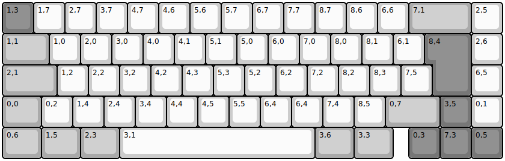
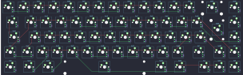

## gmmk/gmmk2/p65/iso/p65_iso

[layout](p65_iso-kle.json) - [PCB](p65_iso.kicad_pcb)

{:loading="lazy"}

[Open in keyboard-layout-editor](http://www.keyboard-layout-editor.com/##@@_c=#777777;&=1,3&_c=#cccccc;&=1,7&=2,7&=3,7&=4,7&=4,6&=5,6&=5,7&=6,7&=7,7&=8,7&=8,6&=6,6&_c=#aaaaaa&w:2;&=7,1&_c=#cccccc;&=2,5;&@_c=#aaaaaa&w:1.5;&=1,1&_c=#cccccc;&=1,0&=2,0&=3,0&=4,0&=4,1&=5,1&=5,0&=6,0&=7,0&=8,0&=8,1&=6,1&_x:0.25&c=#777777&w:1.25&h:2&w2:1.5&h2:1&x2:-0.25;&=8,4&_c=#cccccc;&=2,6;&@_c=#aaaaaa&w:1.75;&=2,1&_c=#cccccc;&=1,2&=2,2&=3,2&=4,2&=4,3&=5,3&=5,2&=6,2&=7,2&=8,2&=8,3&=7,5&_x:1.25;&=6,5;&@_c=#aaaaaa&w:1.25;&=0,0&_c=#cccccc;&=0,2&=1,4&=2,4&=3,4&=4,4&=4,5&=5,5&=6,4&=6,4&=7,4&=8,5&_c=#aaaaaa&w:1.75;&=0,7&_c=#777777;&=3,5&_c=#cccccc;&=0,1;&@_c=#aaaaaa&w:1.25;&=0,6&_w:1.25;&=1,5&_w:1.25;&=2,3&_c=#cccccc&w:6.25;&=3,1&_c=#aaaaaa&w:1.25;&=3,6&_w:1.25;&=3,3&_x:0.5&c=#777777;&=0,3&=7,3&=0,5)

{:loading="lazy"}

