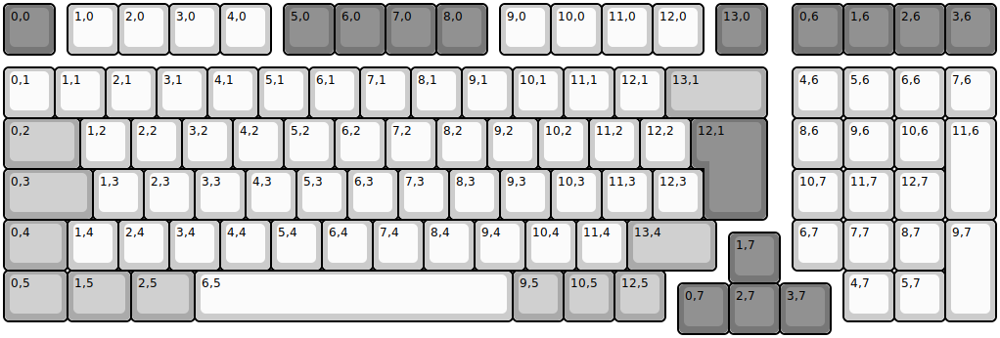
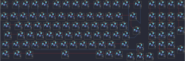

## gmmk/gmmk2/p96/iso/p96_iso

[layout](p96_iso-kle.json) - [PCB](p96_iso.kicad_pcb)

{:loading="lazy"}

[Open in keyboard-layout-editor](http://www.keyboard-layout-editor.com/##@@_c=#777777;&=0,0&_x:0.25&c=#cccccc;&=1,0&=2,0&=3,0&=4,0&_x:0.25&c=#777777;&=5,0&=6,0&=7,0&=8,0&_x:0.25&c=#cccccc;&=9,0&=10,0&=11,0&=12,0&_x:0.25&c=#777777;&=13,0&_x:0.5;&=0,6&=1,6&=2,6&=3,6;&@_y:0.25&c=#cccccc;&=0,1&=1,1&=2,1&=3,1&=4,1&=5,1&=6,1&=7,1&=8,1&=9,1&=10,1&=11,1&=12,1&_c=#aaaaaa&w:2;&=13,1&_x:0.5&c=#cccccc;&=4,6&=5,6&=6,6&=7,6;&@_c=#aaaaaa&w:1.5;&=0,2&_c=#cccccc;&=1,2&=2,2&=3,2&=4,2&=5,2&=6,2&=7,2&=8,2&=9,2&=10,2&=11,2&=12,2&_x:0.25&c=#777777&w:1.25&h:2&w2:1.5&h2:1&x2:-0.25;&=12,1&_x:0.5&c=#cccccc;&=8,6&=9,6&=10,6&_h:2;&=11,6;&@_c=#aaaaaa&w:1.75;&=0,3&_c=#cccccc;&=1,3&=2,3&=3,3&=4,3&=5,3&=6,3&=7,3&=8,3&=9,3&=10,3&=11,3&=12,3&_x:1.75;&=10,7&=11,7&=12,7;&@_c=#aaaaaa&w:1.25;&=0,4&_c=#cccccc;&=1,4&=2,4&=3,4&=4,4&=5,4&=6,4&=7,4&=8,4&=9,4&=10,4&=11,4&_c=#aaaaaa&w:1.75;&=13,4&_x:1.5&c=#cccccc;&=6,7&=7,7&=8,7&_h:2;&=9,7;&@_x:14.25&y:-0.75&c=#777777;&=1,7;&@_y:-0.25&c=#aaaaaa&w:1.25;&=0,5&_w:1.25;&=1,5&_w:1.25;&=2,5&_c=#cccccc&w:6.25;&=6,5&_c=#aaaaaa;&=9,5&=10,5&=12,5&_x:3.5&c=#cccccc;&=4,7&=5,7;&@_x:13.25&y:-0.75&c=#777777;&=0,7&=2,7&=3,7)

{:loading="lazy"}

