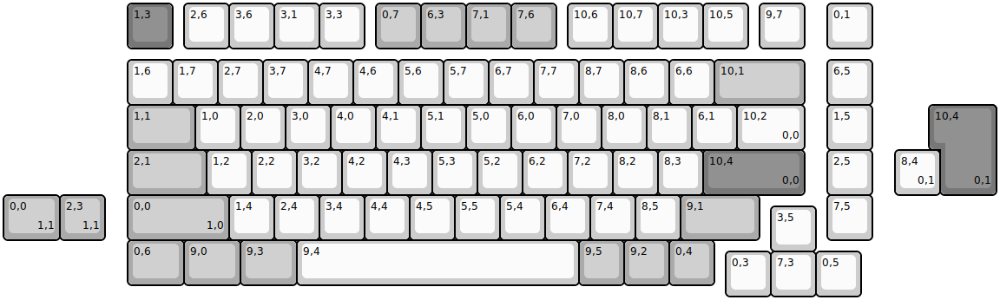
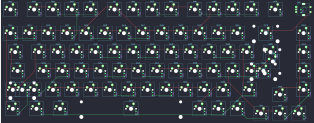

## gmmk/pro/gmmk_pro

[layout](gmmk_pro-kle.json) - [PCB](gmmk_pro.kicad_pcb)

{:loading="lazy"}

[Open in keyboard-layout-editor](http://www.keyboard-layout-editor.com/##@@_x:2.75&c=#777777;&=1,3&_x:0.25&c=#cccccc;&=2,6&=3,6&=3,1&=3,3&_x:0.25&c=#aaaaaa;&=0,7&=6,3&=7,1&=7,6&_x:0.25&c=#cccccc;&=10,6&=10,7&=10,3&=10,5&_x:0.25;&=9,7&_x:0.5;&=0,1%0A%0A%0A%0A%0A%0A%0A%0A%0Ae0;&@_x:2.75&y:0.25;&=1,6&=1,7&=2,7&=3,7&=4,7&=4,6&=5,6&=5,7&=6,7&=7,7&=8,7&=8,6&=6,6&_c=#aaaaaa&w:2;&=10,1&_x:0.5&c=#cccccc;&=6,5;&@_x:2.75&c=#aaaaaa&w:1.5;&=1,1&_c=#cccccc;&=1,0&=2,0&=3,0&=4,0&=4,1&=5,1&=5,0&=6,0&=7,0&=8,0&=8,1&=6,1&_w:1.5;&=10,2%0A%0A%0A0,0&_x:0.5;&=1,5;&@_x:2.75&c=#aaaaaa&w:1.75;&=2,1&_c=#cccccc;&=1,2&=2,2&=3,2&=4,2&=4,3&=5,3&=5,2&=6,2&=7,2&=8,2&=8,3&_c=#777777&w:2.25;&=10,4%0A%0A%0A0,0&_x:0.5&c=#cccccc;&=2,5;&@_x:2.75&c=#aaaaaa&w:2.25;&=0,0%0A%0A%0A1,0&_c=#cccccc;&=1,4&=2,4&=3,4&=4,4&=4,5&=5,5&=5,4&=6,4&=7,4&=8,5&_c=#aaaaaa&w:1.75;&=9,1&_x:1.5&c=#cccccc;&=7,5;&@_x:17&y:-0.75;&=3,5;&@_x:2.75&y:-0.25&c=#aaaaaa&w:1.25;&=0,6&_w:1.25;&=9,0&_w:1.25;&=9,3&_c=#cccccc&w:6.25;&=9,4&_c=#aaaaaa;&=9,5&=9,2&=0,4;&@_x:16&y:-0.75&c=#cccccc;&=0,3&=7,3&=0,5;&@_x:20.75&y:-4.25&c=#777777&w:1.25&h:2&w2:1.5&h2:1&x2:-0.25;&=10,4%0A%0A%0A0,1;&@_x:19.75&c=#cccccc;&=8,4%0A%0A%0A0,1;&@_c=#aaaaaa&w:1.25;&=0,0%0A%0A%0A1,1&=2,3%0A%0A%0A1,1)

{:loading="lazy"}

