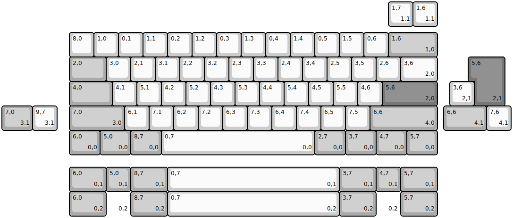
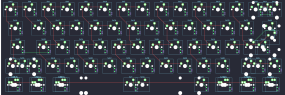
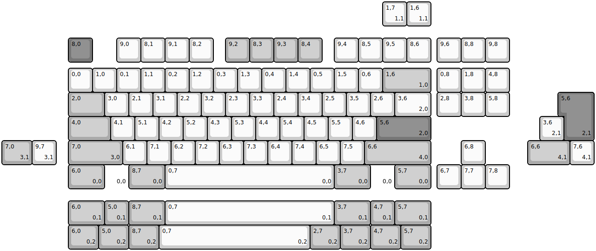
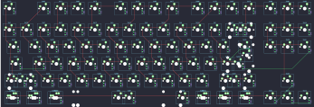

## gon/nerd60

[layout](nerd60-kle.json) - [PCB](nerd60.kicad_pcb)

{:loading="lazy"}

[Open in keyboard-layout-editor](http://www.keyboard-layout-editor.com/##@@_x:2.75&y:1.25;&=8,0&=1,0&=0,1&=1,1&=0,2&=1,2&=0,3&=1,3&=0,4&=1,4&=0,5&=1,5&=0,6&_c=#aaaaaa&w:2;&=1,6%0A%0A%0A1,0;&@_x:2.75&w:1.5;&=2,0&_c=#cccccc;&=3,0&=2,1&=3,1&=2,2&=3,2&=2,3&=3,3&=2,4&=3,4&=2,5&=3,5&=2,6&_w:1.5;&=3,6%0A%0A%0A2,0;&@_x:2.75&c=#aaaaaa&w:1.75;&=4,0&_c=#cccccc;&=4,1&=5,1&=4,2&=5,2&=4,3&=5,3&=4,4&=5,4&=4,5&=5,5&=4,6&_c=#777777&w:2.25;&=5,6%0A%0A%0A2,0;&@_x:2.75&c=#aaaaaa&w:2.25;&=7,0%0A%0A%0A3,0&_c=#cccccc;&=6,1&=7,1&=6,2&=7,2&=6,3&=7,3&=6,4&=7,4&=6,5&=7,5&_c=#aaaaaa&w:2.75;&=6,6%0A%0A%0A4,0;&@_x:2.75&w:1.25;&=6,0%0A%0A%0A0,0&_w:1.25;&=5,0%0A%0A%0A0,0&_w:1.25;&=8,7%0A%0A%0A0,0&_c=#cccccc&w:6.25;&=0,7%0A%0A%0A0,0&_c=#aaaaaa&w:1.25;&=2,7%0A%0A%0A0,0&_w:1.25;&=3,7%0A%0A%0A0,0&_w:1.25;&=4,7%0A%0A%0A0,0&_w:1.25;&=5,7%0A%0A%0A0,0;&@_x:15.75&y:-6.25&c=#cccccc;&=1,7%0A%0A%0A1,1&=1,6%0A%0A%0A1,1;&@_x:19.25&y:1.25&c=#777777&w:1.25&h:2&w2:1.5&h2:1&x2:-0.25;&=5,6%0A%0A%0A2,1;&@_x:18.25&c=#cccccc;&=3,6%0A%0A%0A2,1;&@_c=#aaaaaa&w:1.25;&=7,0%0A%0A%0A3,1&_c=#cccccc;&=9,7%0A%0A%0A3,1&_x:15.75&c=#aaaaaa&w:1.75;&=6,6%0A%0A%0A4,1&_c=#cccccc;&=7,6%0A%0A%0A4,1;&@_x:2.75&y:1.5&c=#aaaaaa&w:1.5;&=6,0%0A%0A%0A0,1&=5,0%0A%0A%0A0,1&_w:1.5;&=8,7%0A%0A%0A0,1&_c=#cccccc&w:7;&=0,7%0A%0A%0A0,1&_c=#aaaaaa&w:1.5;&=3,7%0A%0A%0A0,1&=4,7%0A%0A%0A0,1&_w:1.5;&=5,7%0A%0A%0A0,1;&@_x:2.75&w:1.5;&=6,0%0A%0A%0A0,2&_c=#cccccc&d:true;&=%0A%0A%0A0,2&_c=#aaaaaa&w:1.5;&=8,7%0A%0A%0A0,2&_c=#cccccc&w:7;&=0,7%0A%0A%0A0,2&_c=#aaaaaa&w:1.5;&=3,7%0A%0A%0A0,2&_c=#cccccc&d:true;&=%0A%0A%0A0,2&_c=#aaaaaa&w:1.5;&=5,7%0A%0A%0A0,2)

{:loading="lazy"}

## gon/nerdtkl

[layout](nerdtkl-kle.json) - [PCB](nerdtkl.kicad_pcb)

{:loading="lazy"}

[Open in keyboard-layout-editor](http://www.keyboard-layout-editor.com/##@@_x:2.75&y:1.5&c=#777777;&=8,0&_x:1.0&c=#cccccc;&=9,0&=8,1&=9,1&=8,2&_x:0.5&c=#aaaaaa;&=9,2&=8,3&=9,3&=8,4&_x:0.5&c=#cccccc;&=9,4&=8,5&=9,5&=8,6&_x:0.25;&=9,6&=8,8&=9,8;&@_x:2.75&y:0.25;&=0,0&=1,0&=0,1&=1,1&=0,2&=1,2&=0,3&=1,3&=0,4&=1,4&=0,5&=1,5&=0,6&_c=#aaaaaa&w:2;&=1,6%0A%0A%0A1,0&_x:0.25&c=#cccccc;&=0,8&=1,8&=4,8;&@_x:2.75&c=#aaaaaa&w:1.5;&=2,0&_c=#cccccc;&=3,0&=2,1&=3,1&=2,2&=3,2&=2,3&=3,3&=2,4&=3,4&=2,5&=3,5&=2,6&_w:1.5;&=3,6%0A%0A%0A2,0&_x:0.25;&=2,8&=3,8&=5,8;&@_x:2.75&c=#aaaaaa&w:1.75;&=4,0&_c=#cccccc;&=4,1&=5,1&=4,2&=5,2&=4,3&=5,3&=4,4&=5,4&=4,5&=5,5&=4,6&_c=#777777&w:2.25;&=5,6%0A%0A%0A2,0;&@_x:2.75&c=#aaaaaa&w:2.25;&=7,0%0A%0A%0A3,0&_c=#cccccc;&=6,1&=7,1&=6,2&=7,2&=6,3&=7,3&=6,4&=7,4&=6,5&=7,5&_c=#aaaaaa&w:2.75;&=6,6%0A%0A%0A4,0&_x:1.25&c=#cccccc;&=6,8;&@_x:2.75&c=#aaaaaa&w:1.5;&=6,0%0A%0A%0A0,0&_c=#cccccc&d:true;&=%0A%0A%0A0,0&_c=#aaaaaa&w:1.5;&=8,7%0A%0A%0A0,0&_c=#cccccc&w:7;&=0,7%0A%0A%0A0,0&_c=#aaaaaa&w:1.5;&=3,7%0A%0A%0A0,0&_c=#cccccc&d:true;&=%0A%0A%0A0,0&_c=#aaaaaa&w:1.5;&=5,7%0A%0A%0A0,0&_x:0.25&c=#cccccc;&=6,7&=7,7&=7,8;&@_x:15.75&y:-7.75;&=1,7%0A%0A%0A1,1&=1,6%0A%0A%0A1,1;&@_x:23.25&y:2.75&c=#777777&w:1.25&h:2&w2:1.5&h2:1&x2:-0.25;&=5,6%0A%0A%0A2,1;&@_x:22.25&c=#cccccc;&=3,6%0A%0A%0A2,1;&@_c=#aaaaaa&w:1.25;&=7,0%0A%0A%0A3,1&_c=#cccccc;&=9,7%0A%0A%0A3,1&_x:19.5&c=#aaaaaa&w:1.75;&=6,6%0A%0A%0A4,1&_c=#cccccc;&=7,6%0A%0A%0A4,1;&@_x:2.75&y:1.5&c=#aaaaaa&w:1.5;&=6,0%0A%0A%0A0,1&=5,0%0A%0A%0A0,1&_w:1.5;&=8,7%0A%0A%0A0,1&_c=#cccccc&w:7;&=0,7%0A%0A%0A0,1&_c=#aaaaaa&w:1.5;&=3,7%0A%0A%0A0,1&=4,7%0A%0A%0A0,1&_w:1.5;&=5,7%0A%0A%0A0,1;&@_x:2.75&w:1.25;&=6,0%0A%0A%0A0,2&_w:1.25;&=5,0%0A%0A%0A0,2&_w:1.25;&=8,7%0A%0A%0A0,2&_c=#cccccc&w:6.25;&=0,7%0A%0A%0A0,2&_c=#aaaaaa&w:1.25;&=2,7%0A%0A%0A0,2&_w:1.25;&=3,7%0A%0A%0A0,2&_w:1.25;&=4,7%0A%0A%0A0,2&_w:1.25;&=5,7%0A%0A%0A0,2)

{:loading="lazy"}

