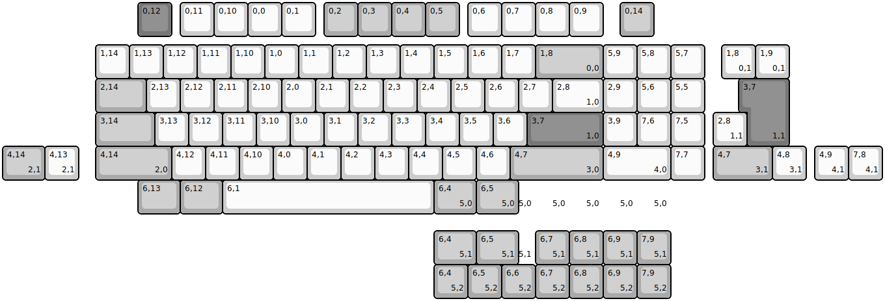
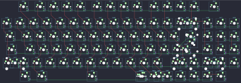

## graystudio/hb85

[layout](hb85-kle.json) - [PCB](hb85.kicad_pcb)

{:loading="lazy"}

[Open in keyboard-layout-editor](http://www.keyboard-layout-editor.com/##@@_x:4&c=#777777;&=0,12&_x:0.25&c=#cccccc;&=0,11&=0,10&=0,0&=0,1&_x:0.25&c=#aaaaaa;&=0,2&=0,3&=0,4&=0,5&_x:0.25&c=#cccccc;&=0,6&=0,7&=0,8&=0,9&_x:0.5&c=#aaaaaa;&=0,14;&@_x:2.75&y:0.25&c=#cccccc;&=1,14&=1,13&=1,12&=1,11&=1,10&=1,0&=1,1&=1,2&=1,3&=1,4&=1,5&=1,6&=1,7&_c=#aaaaaa&w:2;&=1,8%0A%0A%0A0,0&_c=#cccccc;&=5,9&=5,8&=5,7;&@_x:2.75&c=#aaaaaa&w:1.5;&=2,14&_c=#cccccc;&=2,13&=2,12&=2,11&=2,10&=2,0&=2,1&=2,2&=2,3&=2,4&=2,5&=2,6&=2,7&_w:1.5;&=2,8%0A%0A%0A1,0&=2,9&=5,6&=5,5;&@_x:2.75&c=#aaaaaa&w:1.75;&=3,14&_c=#cccccc;&=3,13&=3,12&=3,11&=3,10&=3,0&=3,1&=3,2&=3,3&=3,4&=3,5&=3,6&_c=#777777&w:2.25;&=3,7%0A%0A%0A1,0&_c=#cccccc;&=3,9&=7,6&=7,5;&@_x:2.75&c=#aaaaaa&w:2.25;&=4,14%0A%0A%0A2,0&_c=#cccccc;&=4,12&=4,11&=4,10&=4,0&=4,1&=4,2&=4,3&=4,4&=4,5&=4,6&_c=#aaaaaa&w:2.75;&=4,7%0A%0A%0A3,0&_c=#cccccc&w:2;&=4,9%0A%0A%0A4,0&=7,7;&@_x:4&c=#aaaaaa&w:1.25;&=6,13&_w:1.25;&=6,12&_c=#cccccc&w:6.26;&=6,1&_x:-0.01&c=#aaaaaa&w:1.25;&=6,4%0A%0A%0A5,0&_w:1.25;&=6,5%0A%0A%0A5,0&_c=#cccccc&w:0.5&d:true;&=%0A%0A%0A5,0&_c=#aaaaaa&d:true;&=%0A%0A%0A5,0&_d:true;&=%0A%0A%0A5,0&_d:true;&=%0A%0A%0A5,0&_d:true;&=%0A%0A%0A5,0;&@_x:21.25&y:-5.0&c=#cccccc;&=1,8%0A%0A%0A0,1&=1,9%0A%0A%0A0,1;&@_x:22.0&c=#777777&w:1.25&h:2&w2:1.5&h2:1&x2:-0.25;&=3,7%0A%0A%0A1,1;&@_x:21.0&c=#cccccc;&=2,8%0A%0A%0A1,1;&@_c=#aaaaaa&w:1.25;&=4,14%0A%0A%0A2,1&_c=#cccccc;&=4,13%0A%0A%0A2,1&_x:18.75&c=#aaaaaa&w:1.75;&=4,7%0A%0A%0A3,1&_c=#cccccc;&=4,8%0A%0A%0A3,1&_x:0.25;&=4,9%0A%0A%0A4,1&=7,8%0A%0A%0A4,1;&@_x:12.75&y:1.5&c=#aaaaaa&w:1.25;&=6,4%0A%0A%0A5,1&_w:1.25;&=6,5%0A%0A%0A5,1&_c=#cccccc&w:0.5&d:true;&=%0A%0A%0A5,1&_c=#aaaaaa;&=6,7%0A%0A%0A5,1&=6,8%0A%0A%0A5,1&=6,9%0A%0A%0A5,1&=7,9%0A%0A%0A5,1;&@_x:12.75;&=6,4%0A%0A%0A5,2&=6,5%0A%0A%0A5,2&=6,6%0A%0A%0A5,2&=6,7%0A%0A%0A5,2&=6,8%0A%0A%0A5,2&=6,9%0A%0A%0A5,2&=7,9%0A%0A%0A5,2)

{:loading="lazy"}

