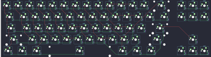

## h0oni/hotduck

[layout](hotduck-kle.json) - [PCB](hotduck.kicad_pcb)

{:loading="lazy"}

[Open in keyboard-layout-editor](http://www.keyboard-layout-editor.com/##@@=0,0&=0,1&=0,2&=0,3&=0,4&=0,5&=0,6&=0,7&=0,8&=0,9&=1,9&=5,9&=5,8&_w:2;&=5,7&_x:0.25;&=6,9&=6,8&=6,7;&@_w:1.5;&=1,0&=1,1&=1,2&=1,3&=1,4&=1,5&=1,6&=1,7&=1,8&=2,9&=3,9&=4,9&=5,6&_w:1.5;&=5,5&_x:0.25;&=6,6&=6,5&=6,4;&@_w:1.75;&=2,0&=2,1&=2,2&=2,3&=2,4&=2,5&=3,5&=2,6&=2,7&=2,8&=3,8&=5,4&_w:2.25;&=5,3;&@_w:2.25;&=3,0&=3,1&=3,2&=3,3&=3,4&=4,4&=4,5&=4,6&=3,6&=3,7&=4,8&_w:2.75;&=5,2&_x:1.25;&=6,3;&@_w:1.25;&=4,0&_w:1.25;&=4,1&_w:1.25;&=4,2&_w:6.25;&=4,3&_w:1.25;&=4,7&_w:1.25;&=5,0&_w:1.25;&=5,1&_x:1.5;&=6,0&=6,1&=6,2)

{:loading="lazy"}

