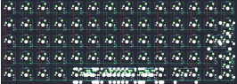

## handwired/3dortho14u

[layout](3dortho14u-kle.json) - [PCB](3dortho14u.kicad_pcb)

{:loading="lazy"}

[Open in keyboard-layout-editor](http://www.keyboard-layout-editor.com/##@@_c=#777777;&=0,0&_c=#cccccc;&=0,1&=0,2&=0,3&=0,4&=0,5&=0,6&=0,7&=0,8&=0,9&=0,10&=0,11&=0,12&_c=#777777;&=0,13;&@_c=#aaaaaa;&=1,0&_c=#cccccc;&=1,1&=1,2&=1,3&=1,4&=1,5&=1,6&=1,7&=1,8&=1,9&=1,10&=1,11&=1,12&=1,13%0A%0A%0A0,0;&@_c=#aaaaaa;&=2,0&_c=#cccccc;&=2,1&=2,2&=2,3&=2,4&=2,5&=2,6&=2,7&=2,8&=2,9&=2,10&=2,11&_c=#777777&w:2;&=2,13%0A%0A%0A0,0;&@_c=#aaaaaa;&=3,0&_c=#cccccc;&=3,1&=3,2&=3,3&=3,4&=3,5&=3,6&=3,7&=3,8&=3,9&=3,10&=3,11&_c=#aaaaaa;&=3,12&=3,13%0A%0A%0A1,0;&@=4,0&=4,1&=4,2&=4,3&_c=#cccccc&w:6;&=4,6%0A%0A%0A3,0&_c=#aaaaaa;&=4,10%0A%0A%0A2,0&=4,11%0A%0A%0A2,0&=4,12&=4,13%0A%0A%0A1,0;&@_x:15.25&y:-4&c=#cccccc;&=1,13%0A%0A%0A0,1&_x:1.25&c=#777777&h:2;&=1,13%0A%0A%0A0,2;&@_x:14.25&c=#cccccc;&=2,12%0A%0A%0A0,1&=2,13%0A%0A%0A0,1&_x:0.25;&=2,12%0A%0A%0A0,2;&@_x:17.5&c=#777777&h:2;&=3,13%0A%0A%0A1,1;&@_x:14.25&c=#cccccc&w:2;&=4,11%0A%0A%0A2,1;&@_x:4&y:0.25&w:2.75;&=4,4%0A%0A%0A3,1&=4,6%0A%0A%0A3,1&_w:2.25;&=4,9%0A%0A%0A3,1;&@_x:4&w:2.25;&=4,4%0A%0A%0A3,2&=4,6%0A%0A%0A3,2&_w:2.75;&=4,9%0A%0A%0A3,2;&@_x:4&w:2.75;&=4,4%0A%0A%0A3,3&_w:2.25;&=4,6%0A%0A%0A3,3&=4,9%0A%0A%0A3,3;&@_x:4&w:2.25;&=4,4%0A%0A%0A3,4&_w:2.75;&=4,6%0A%0A%0A3,4&=4,9%0A%0A%0A3,4;&@_x:4;&=4,4%0A%0A%0A3,5&_w:2.25;&=4,6%0A%0A%0A3,5&_w:2.75;&=4,9%0A%0A%0A3,5;&@_x:4;&=4,4%0A%0A%0A3,6&_w:2.75;&=4,6%0A%0A%0A3,6&_w:2.25;&=4,9%0A%0A%0A3,6;&@_x:4;&=4,4%0A%0A%0A3,7&=4,5%0A%0A%0A3,7&=4,6%0A%0A%0A3,7&=4,7%0A%0A%0A3,7&=4,8%0A%0A%0A3,7&=4,9%0A%0A%0A3,7;&@_x:4&w:2;&=4,4%0A%0A%0A3,8&_w:2;&=4,6%0A%0A%0A3,8&_w:2;&=4,9%0A%0A%0A3,8;&@_x:4&w:3;&=4,4%0A%0A%0A3,9&_w:3;&=4,9%0A%0A%0A3,9)

{:loading="lazy"}

