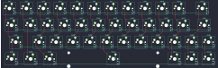

## handwired/carpolly

[layout](carpolly-kle.json) - [PCB](carpolly.kicad_pcb)

{:loading="lazy"}

[Open in keyboard-layout-editor](http://www.keyboard-layout-editor.com/##@@=0,0&=0,1&=0,2&=0,3&=0,4&=0,5&=0,6&=0,7&=0,8&=0,9&=0,10&_w:1.75;&=0,11;&@_w:1.25;&=1,0&=1,1&=1,2&=1,3&=1,4&=1,5&=1,6&=1,7&=1,8&=1,9&=1,10&_w:1.5;&=1,11;&@_w:1.75;&=2,0&=2,2&=2,3&=2,4&=2,5&=2,6&=2,7&=2,8&=2,9&=2,10&=2,11&=2,12;&@_w:1.25;&=3,0&=3,1&_w:1.25;&=3,2&_w:6.25;&=3,6&=3,10&=3,11&=3,12)

{:loading="lazy"}

