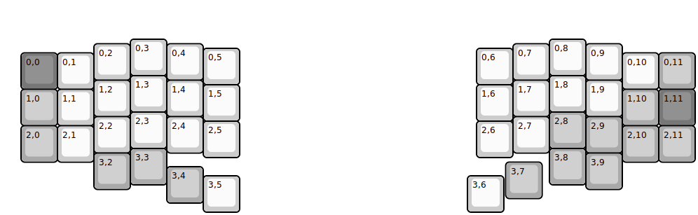
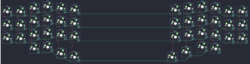

## handwired/croxsplit44

[layout](croxsplit44-kle.json) - [PCB](croxsplit44.kicad_pcb)

{:loading="lazy"}

[Open in keyboard-layout-editor](http://www.keyboard-layout-editor.com/##@@_x:3.5&y:1;&=0,3&_x:10.5;&=0,8;&@_x:2.5&y:-0.875;&=0,2&_x:1.0;&=0,4&_x:8.5;&=0,7&_x:1.0;&=0,9;&@_x:5.5&y:-0.875;&=0,5&_x:6.5;&=0,6;&@_x:0.5&y:-0.875&c=#777777;&=0,0&_c=#cccccc;&=0,1&_x:14.5;&=0,10&_c=#aaaaaa;&=0,11;&@_x:3.5&y:-0.375&c=#cccccc;&=1,3&_x:10.5;&=1,8;&@_x:2.5&y:-0.875;&=1,2&_x:1.0;&=1,4&_x:8.5;&=1,7&_x:1.0;&=1,9;&@_x:5.5&y:-0.875;&=1,5&_x:6.5;&=1,6;&@_x:0.5&y:-0.875&c=#aaaaaa;&=1,0&_c=#cccccc;&=1,1&_x:14.5&c=#aaaaaa;&=1,10&_c=#777777;&=1,11;&@_x:3.5&y:-0.375&c=#cccccc;&=2,3&_x:10.5&c=#aaaaaa;&=2,8;&@_x:2.5&y:-0.875&c=#cccccc;&=2,2&_x:1.0;&=2,4&_x:8.5;&=2,7&_x:1.0&c=#aaaaaa;&=2,9;&@_x:5.5&y:-0.875&c=#cccccc;&=2,5&_x:6.5;&=2,6;&@_x:0.5&y:-0.875&c=#aaaaaa;&=2,0&_c=#cccccc;&=2,1&_x:14.5&c=#aaaaaa;&=2,10&=2,11;&@_x:3.5&y:-0.375;&=3,3&_x:10.5;&=3,8;&@_x:2.5&y:-0.875;&=3,2&_x:12.5;&=3,9;&@_x:13.8&y:-0.75;&=3,7;&@_x:4.5&y:-0.875;&=3,4;&@_x:5.5&y:-0.75&c=#cccccc;&=3,5&_x:6.25;&=3,6)

{:loading="lazy"}

