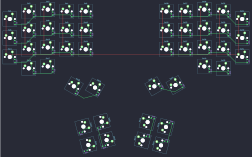

## handwired/dactyl_manuform/4x5

[layout](4x5-kle.json) - [PCB](4x5.kicad_pcb)

{:loading="lazy"}

[Open in keyboard-layout-editor](http://www.keyboard-layout-editor.com/##@@_x:2;&=0,2&_x:7.25;&=5,2;&@_x:1&y:-0.9;&=0,1&_x:1;&=0,3&=0,4&_x:3.25;&=5,4&=5,3&_x:1.0;&=5,1;&@_y:-0.6;&=0,0&_x:11.25;&=5,0;&@_x:2&y:-0.5;&=1,2&_x:7.25;&=6,2;&@_x:1&y:-0.9;&=1,1&_x:1;&=1,3&=1,4&_x:3.25;&=6,4&=6,3&_x:1.0;&=6,1;&@_y:-0.6;&=1,0&_x:11.25;&=6,0;&@_x:2&y:-0.5;&=2,2&_x:7.25;&=7,2;&@_x:1&y:-0.9;&=2,1&_x:1;&=2,3&=2,4&_x:3.25;&=7,4&=7,3;&@_y:-0.6;&=2,0&_x:11.25;&=7,0;&@_x:2&y:-0.5;&=3,2&_x:7.25;&=8,2;&@_x:1&y:-0.9;&=3,1&_x:9.25;&=8,1;&@_ry:4.25&x:11.25&y:-2.15;&=7,1;&@_r:30&rx:6.5&ry:0&x:0.5&y:4&c=#777777&h:1.5;&=3,4;&@_x:-0.5&y:-0.5&h:1.5;&=3,3;&@_r:75&ry:3&x:2.5&y:1.5&c=#aaaaaa;&=4,3&=4,1;&@_x:2.5;&=4,4&=4,2;&@_r:-75&rx:13&ry:5.25&x:-4&y:-5.25;&=9,1&=9,3;&@_x:-4;&=9,2&=9,4;&@_r:-30&ry:0&x:-7&y:0.75&c=#777777&h:1.5;&=8,4;&@_x:-6&y:-0.5&h:1.5;&=8,3)

{:loading="lazy"}

