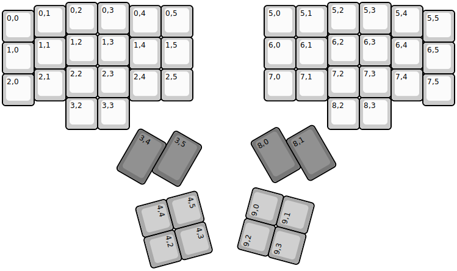
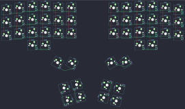

## handwired/dactyl_manuform/4x6

[layout](4x6-kle.json) - [PCB](4x6.kicad_pcb)

{:loading="lazy"}

[Open in keyboard-layout-editor](http://www.keyboard-layout-editor.com/##@@_x:2;&=0,2&=0,3&_x:6.25;&=5,2&=5,3;&@_x:1&y:-0.9;&=0,1&_x:2;&=0,4&=0,5&_x:2.25;&=5,0&=5,1&_x:2.0;&=5,4;&@_y:-0.85;&=0,0&_x:12.25;&=5,5;&@_x:2&y:-0.25;&=1,2&=1,3&_x:6.25;&=6,2&=6,3;&@_x:1&y:-0.9;&=1,1&_x:2;&=1,4&=1,5&_x:2.25;&=6,0&=6,1&_x:2.0;&=6,4;&@_y:-0.85;&=1,0&_x:12.25;&=6,5;&@_x:2&y:-0.25;&=2,2&=2,3&_x:6.25;&=7,2&=7,3;&@_x:1&y:-0.9;&=2,1&_x:2;&=2,4&=2,5&_x:2.25;&=7,0&=7,1;&@_y:-0.85;&=2,0&_x:12.25;&=7,5;&@_x:2&y:-0.25;&=3,2&=3,3&_x:6.25;&=8,2&=8,3;&@_ry:4.25&x:12.25&y:-2.15;&=7,4;&@_r:30&rx:6.5&ry:0.25&x:1.0&y:3.75&c=#777777&h:1.5;&=3,5;&@_y:-0.5&h:1.5;&=3,4;&@_r:75&ry:3&x:2.75&y:1&c=#aaaaaa;&=4,5&=4,3;&@_x:2.75;&=4,4&=4,2;&@_r:-75&rx:13&ry:5.25&x:-4&y:-4.75;&=9,2&=9,0;&@_x:-4;&=9,3&=9,1;&@_r:-30&ry:0&x:-6.75&y:1.25&c=#777777&h:1.5;&=8,0;&@_x:-5.75&y:-0.5&h:1.5;&=8,1)

{:loading="lazy"}

