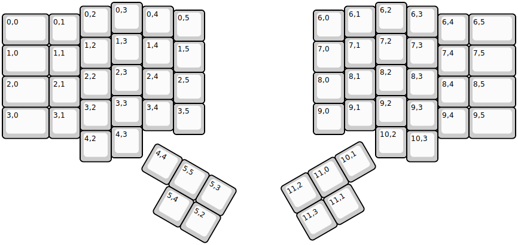
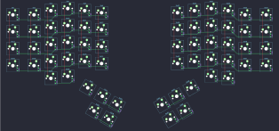

## handwired/dactyl_manuform/5x6_5

[layout](5x6_5-kle.json) - [PCB](5x6_5.kicad_pcb)

{:loading="lazy"}

[Open in keyboard-layout-editor](http://www.keyboard-layout-editor.com/##@@_x:3.5;&=0,3&_x:7.5;&=6,2;&@_x:2.5&y:-0.875;&=0,2&_x:1.0;&=0,4&_x:5.5;&=6,1&_x:1.0;&=6,3;&@_x:5.5&y:-0.875;&=0,5&_x:3.5;&=6,0;&@_y:-0.875&w:1.5;&=0,0&=0,1&_x:11.5;&=6,4&_w:1.5;&=6,5;&@_x:3.5&y:-0.375;&=1,3&_x:7.5;&=7,2;&@_x:2.5&y:-0.875;&=1,2&_x:1.0;&=1,4&_x:5.5;&=7,1&_x:1.0;&=7,3;&@_x:5.5&y:-0.875;&=1,5&_x:3.5;&=7,0;&@_y:-0.875&w:1.5;&=1,0&=1,1&_x:11.5;&=7,4&_w:1.5;&=7,5;&@_x:3.5&y:-0.375;&=2,3&_x:7.5;&=8,2;&@_x:2.5&y:-0.875;&=2,2&_x:1.0;&=2,4&_x:5.5;&=8,1&_x:1.0;&=8,3;&@_x:5.5&y:-0.875;&=2,5&_x:3.5;&=8,0;&@_y:-0.875&w:1.5;&=2,0&=2,1&_x:11.5;&=8,4&_w:1.5;&=8,5;&@_x:3.5&y:-0.375;&=3,3&_x:7.5;&=9,2;&@_x:2.5&y:-0.875;&=3,2&_x:1.0;&=3,4&_x:5.5;&=9,1&_x:1.0;&=9,3;&@_x:5.5&y:-0.875;&=3,5&_x:3.5;&=9,0;&@_y:-0.875&w:1.5;&=3,0&=3,1&_x:11.5;&=9,4&_w:1.5;&=9,5;&@_x:3.5&y:-0.375;&=4,3&_x:7.5;&=10,2;&@_x:2.5&y:-0.875;&=4,2&_x:9.5;&=10,3;&@_r:30&rx:5&ry:4.5;&=4,4&=5,5&=5,3;&@_x:1;&=5,4&=5,2;&@_r:-30&rx:11.5&x:-3.0;&=11,2&=11,0&=10,1;&@_x:-3.0;&=11,3&=11,1)

{:loading="lazy"}

