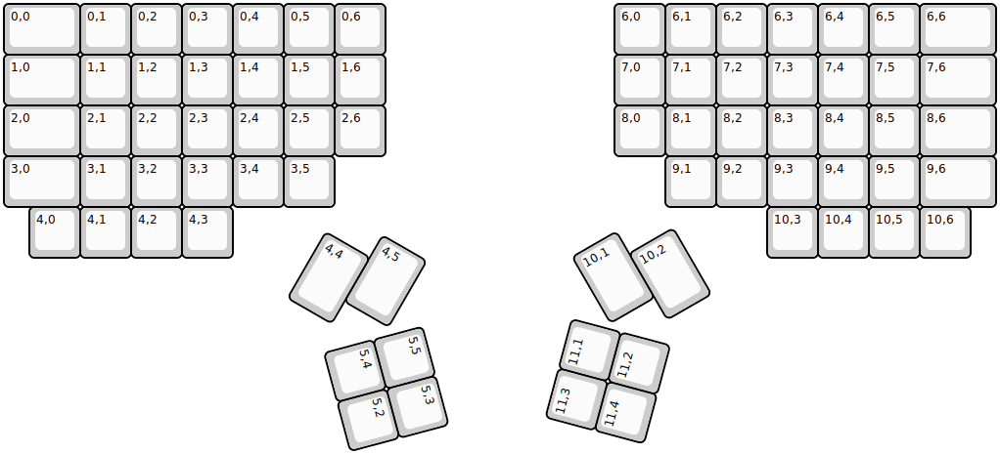
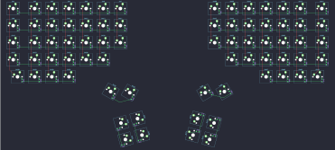

## handwired/dactyl_manuform/5x7

[layout](5x7-kle.json) - [PCB](5x7.kicad_pcb)

{:loading="lazy"}

[Open in keyboard-layout-editor](http://www.keyboard-layout-editor.com/##@@_w:1.5;&=0,0&=0,1&=0,2&=0,3&=0,4&=0,5&=0,6&_x:4.5;&=6,0&=6,1&=6,2&=6,3&=6,4&=6,5&_w:1.5;&=6,6;&@_w:1.5;&=1,0&=1,1&=1,2&=1,3&=1,4&=1,5&=1,6&_x:4.5;&=7,0&=7,1&=7,2&=7,3&=7,4&=7,5&_w:1.5;&=7,6;&@_w:1.5;&=2,0&=2,1&=2,2&=2,3&=2,4&=2,5&=2,6&_x:4.5;&=8,0&=8,1&=8,2&=8,3&=8,4&=8,5&_w:1.5;&=8,6;&@_w:1.5;&=3,0&=3,1&=3,2&=3,3&=3,4&=3,5&_x:6.5;&=9,1&=9,2&=9,3&=9,4&=9,5&_w:1.5;&=9,6;&@_x:0.5;&=4,0&=4,1&=4,2&=4,3&_x:10.5;&=10,3&=10,4&=10,5&=10,6;&@_r:30&rx:6.5&ry:4.25&x:1.0&y:-0.25&h:1.5;&=4,5;&@_y:-0.5&h:1.5;&=4,4;&@_r:75&x:2.5&y:-2.5;&=5,5&=5,3;&@_x:2.5;&=5,4&=5,2;&@_r:-75&rx:13&x:-4.5&y:-1.25;&=11,3&=11,1;&@_x:-4.5;&=11,4&=11,2;&@_r:-30&x:-2&y:-1.0&h:1.5;&=10,1;&@_x:-1&y:-0.5&h:1.5;&=10,2)

{:loading="lazy"}

