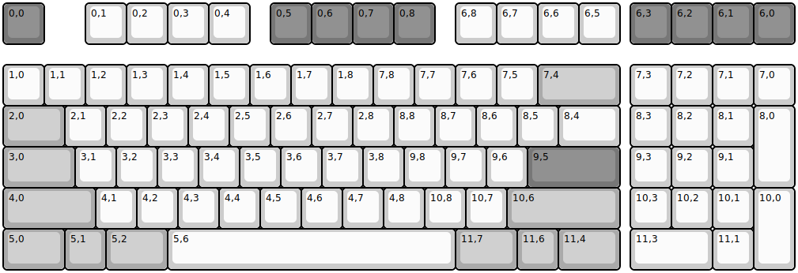
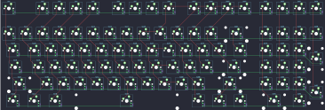

## handwired/marauder

[layout](marauder-kle.json) - [PCB](marauder.kicad_pcb)

{:loading="lazy"}

[Open in keyboard-layout-editor](http://www.keyboard-layout-editor.com/##@@_c=#777777;&=0,0&_x:1&c=#cccccc;&=0,1&=0,2&=0,3&=0,4&_x:0.5&c=#777777;&=0,5&=0,6&=0,7&=0,8&_x:0.5&c=#cccccc;&=6,8&=6,7&=6,6&=6,5&_x:0.25&c=#777777;&=6,3&=6,2&=6,1&=6,0;&@_y:0.5&c=#cccccc;&=1,0&=1,1&=1,2&=1,3&=1,4&=1,5&=1,6&=1,7&=1,8&=7,8&=7,7&=7,6&=7,5&_c=#aaaaaa&w:2;&=7,4&_x:0.25&c=#cccccc;&=7,3&=7,2&=7,1&=7,0;&@_c=#aaaaaa&w:1.5;&=2,0&_c=#cccccc;&=2,1&=2,2&=2,3&=2,4&=2,5&=2,6&=2,7&=2,8&=8,8&=8,7&=8,6&=8,5&_w:1.5;&=8,4&_x:0.25;&=8,3&=8,2&=8,1&_h:2;&=8,0;&@_c=#aaaaaa&w:1.75;&=3,0&_c=#cccccc;&=3,1&=3,2&=3,3&=3,4&=3,5&=3,6&=3,7&=3,8&=9,8&=9,7&=9,6&_c=#777777&w:2.25;&=9,5&_x:0.25&c=#cccccc;&=9,3&=9,2&=9,1;&@_c=#aaaaaa&w:2.25;&=4,0&_c=#cccccc;&=4,1&=4,2&=4,3&=4,4&=4,5&=4,6&=4,7&=4,8&=10,8&=10,7&_c=#aaaaaa&w:2.75;&=10,6&_x:0.25&c=#cccccc;&=10,3&=10,2&=10,1&_h:2;&=10,0;&@_c=#aaaaaa&w:1.5;&=5,0&=5,1&_w:1.5;&=5,2&_c=#cccccc&w:7;&=5,6&_c=#aaaaaa&w:1.5;&=11,7&=11,6&_w:1.5;&=11,4&_x:0.25&c=#cccccc&w:2;&=11,3&=11,1)

{:loading="lazy"}

