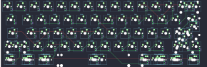

## hasu/alps64

[layout](alps64-kle.json) - [PCB](alps64.kicad_pcb)

{:loading="lazy"}

[Open in keyboard-layout-editor](http://www.keyboard-layout-editor.com/##@@_x:2.75;&=3,6&=3,7&=4,6&=4,7&=5,6&=5,7&=6,6&=6,7&=7,6&=7,7&=0,6&=0,7&=1,7&_c=#aaaaaa&w:2;&=2,7%0A%0A%0A3,0;&@_x:2.75&w:1.5;&=3,4&_c=#cccccc;&=3,5&=4,4&=4,5&=5,4&=5,5&=6,4&=6,5&=7,5&=0,5&=1,5&=1,6&=2,5&_w:1.5;&=2,4%0A%0A%0A0,0;&@_x:2.75&c=#aaaaaa&w:1.75;&=3,2&_c=#cccccc;&=3,3&=4,3&=5,2&=5,3&=6,3&=7,3&=7,4&=0,3&=0,4&=1,3&=1,4&_c=#777777&w:2.25;&=2,3%0A%0A%0A0,0;&@_x:2.75&c=#aaaaaa&w:2.25;&=3,1%0A%0A%0A1,0&_c=#cccccc;&=4,2&=5,1&=6,1&=6,2&=7,1&=7,2&=0,1&=0,2&=1,1&=1,2&_c=#aaaaaa&w:2.75;&=2,1%0A%0A%0A2,0;&@_x:2.75&w:1.25;&=3,0%0A%0A%0A4,0&_w:1.25;&=4,0%0A%0A%0A4,0&_w:1.25;&=5,0%0A%0A%0A4,0&_c=#cccccc&w:6.25;&=6,0%0A%0A%0A4,0&_c=#aaaaaa&w:1.25;&=7,0%0A%0A%0A4,0&_w:1.25;&=0,0%0A%0A%0A4,0&_w:1.25;&=1,0%0A%0A%0A4,0&_w:1.25;&=2,0%0A%0A%0A4,0;&@_x:18.25&y:-5&c=#cccccc;&=2,6%0A%0A%0A3,1&_c=#aaaaaa;&=2,7%0A%0A%0A3,1;&@_x:19.25&c=#777777&w:1.25&h:2&w2:1.5&h2:1&x2:-0.25;&=2,3%0A%0A%0A0,1&_x:0.75&w:1.5&h:2&w2:2.25&h2:1&x2:-0.75&y2:1;&=2,3%0A%0A%0A0,2;&@_x:18.25&c=#cccccc;&=2,4%0A%0A%0A0,1;&@_c=#aaaaaa&w:1.25;&=3,1%0A%0A%0A1,1&_c=#cccccc;&=4,1%0A%0A%0A1,1&_x:16.0&c=#aaaaaa&w:1.75;&=2,1%0A%0A%0A2,1&=2,2%0A%0A%0A2,1;&@_x:2.75&y:1.25&w:1.5;&=3,0%0A%0A%0A4,1&=4,0%0A%0A%0A4,1&_w:1.5;&=5,0%0A%0A%0A4,1&_c=#cccccc&w:7;&=6,0%0A%0A%0A4,1&_c=#aaaaaa&w:1.5;&=0,0%0A%0A%0A4,1&=1,0%0A%0A%0A4,1&_w:1.5;&=2,0%0A%0A%0A4,1;&@_x:2.75&w:1.5;&=3,0%0A%0A%0A4,2&_d:true;&=%0A%0A%0A4,2&_w:1.5;&=5,0%0A%0A%0A4,2&_c=#cccccc&w:7;&=6,0%0A%0A%0A4,2&_c=#aaaaaa&w:1.5;&=0,0%0A%0A%0A4,2&_d:true;&=%0A%0A%0A4,2&_w:1.5;&=2,0%0A%0A%0A4,2;&@_x:2.75&w:1.5;&=3,0%0A%0A%0A4,3&=4,0%0A%0A%0A4,3&_w:1.5;&=5,0%0A%0A%0A4,3&_c=#cccccc&w:6;&=6,0%0A%0A%0A4,3&_c=#aaaaaa&w:1.5;&=7,0%0A%0A%0A4,3&=0,0%0A%0A%0A4,3&=1,0%0A%0A%0A4,3&_w:1.5;&=2,0%0A%0A%0A4,3;&@_x:2.75&w:1.5;&=3,0%0A%0A%0A4,4&_w:1.25;&=4,0%0A%0A%0A4,4&_w:1.5;&=5,0%0A%0A%0A4,4&_c=#cccccc&w:6.5;&=6,0%0A%0A%0A4,4&_c=#aaaaaa&w:1.5;&=0,0%0A%0A%0A4,4&_w:1.25;&=1,0%0A%0A%0A4,4&_w:1.5;&=2,0%0A%0A%0A4,4;&@_x:2.75&w:1.5&d:true;&=%0A%0A%0A4,5&=4,0%0A%0A%0A4,5&_w:1.5;&=5,0%0A%0A%0A4,5&_c=#cccccc&w:6;&=6,0%0A%0A%0A4,5&_c=#aaaaaa&w:1.5;&=7,0%0A%0A%0A4,5&=0,0%0A%0A%0A4,5&=1,0%0A%0A%0A4,5&_w:1.5&d:true;&=%0A%0A%0A4,5)

{:loading="lazy"}

