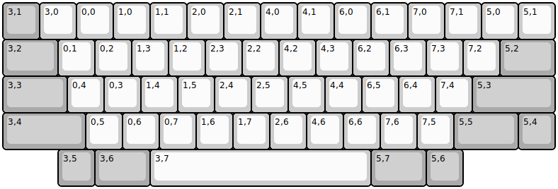
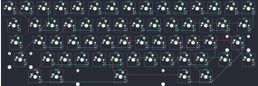

## hhkb/ansi

[layout](ansi-kle.json) - [PCB](ansi.kicad_pcb)

{:loading="lazy"}

[Open in keyboard-layout-editor](http://www.keyboard-layout-editor.com/##@_name=HHKB;&@_c=#aaaaaa;&=3,1&_c=#cccccc;&=3,0&=0,0&=1,0&=1,1&=2,0&=2,1&=4,0&=4,1&=6,0&=6,1&=7,0&=7,1&=5,0&=5,1;&@_c=#aaaaaa&w:1.5;&=3,2&_c=#cccccc;&=0,1&=0,2&=1,3&=1,2&=2,3&=2,2&=4,2&=4,3&=6,2&=6,3&=7,3&=7,2&_c=#aaaaaa&w:1.5;&=5,2;&@_w:1.75;&=3,3&_c=#cccccc;&=0,4&=0,3&=1,4&=1,5&=2,4&=2,5&=4,5&=4,4&=6,5&=6,4&=7,4&_c=#aaaaaa&w:2.25;&=5,3;&@_w:2.25;&=3,4&_c=#cccccc;&=0,5&=0,6&=0,7&=1,6&=1,7&=2,6&=4,6&=6,6&=7,6&=7,5&_c=#aaaaaa&w:1.75;&=5,5&=5,4;&@_x:1.5;&=3,5&_w:1.5;&=3,6&_c=#cccccc&w:6;&=3,7&_c=#aaaaaa&w:1.5;&=5,7&=5,6)

{:loading="lazy"}

