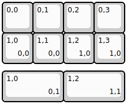
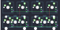

## hineybush/h08

[layout](h08-kle.json) - [PCB](h08.kicad_pcb)

{:loading="lazy"}

[Open in keyboard-layout-editor](http://www.keyboard-layout-editor.com/##@@=0,0&=0,1&=0,2&=0,3;&@=1,0%0A%0A%0A0,0&=1,1%0A%0A%0A0,0&=1,2%0A%0A%0A1,0&=1,3%0A%0A%0A1,0;&@_y:0.25&w:2;&=1,0%0A%0A%0A0,1&_w:2;&=1,2%0A%0A%0A1,1)

{:loading="lazy"}

