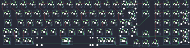

## hineybush/ibis

[layout](ibis-kle.json) - [PCB](ibis.kicad_pcb)

{:loading="lazy"}

[Open in keyboard-layout-editor](http://www.keyboard-layout-editor.com/##@@_x:2.5&y:1.5&c=#777777;&=0,0&_c=#cccccc;&=1,0&=0,1&=1,1&=0,2&=1,2&=0,3&=1,3&=0,4&=1,4&=0,5&=1,5&=0,6&_c=#aaaaaa&w:2;&=1,7%0A%0A%0A0,0&_x:0.25;&=3,7&_x:0.25;&=0,8&=1,8&=0,9&=1,9;&@_x:2.5&w:1.5;&=2,0&_c=#cccccc;&=3,0&=2,1&=3,1&=2,2&=3,2&=2,3&=3,3&=2,4&=3,4&=2,5&=3,5&=2,6&_w:1.5;&=3,6%0A%0A%0A1,0&_x:0.25&c=#aaaaaa;&=5,7&_x:0.25&c=#cccccc;&=2,8&=3,8&=2,9&_c=#aaaaaa&h:2;&=5,9%0A%0A%0A4,0;&@_x:2.5&w:1.75;&=4,0&_c=#cccccc;&=5,0&=4,1&=5,1&=4,2&=5,2&=4,3&=5,3&=4,4&=5,4&=4,5&=5,5&_c=#777777&w:2.25;&=5,6%0A%0A%0A1,0&_x:1.5&c=#cccccc;&=4,8&=5,8&=4,9;&@_x:2.5&c=#aaaaaa&w:2.25;&=6,0%0A%0A%0A2,0&_c=#cccccc;&=6,1&=7,1&=6,2&=7,2&=6,3&=7,3&=6,4&=7,4&=6,5&=7,5&_c=#aaaaaa&w:2.75;&=6,6%0A%0A%0A3,0&_x:1.5&c=#cccccc;&=6,8&=7,8&=6,9&_c=#777777&h:2;&=9,9%0A%0A%0A5,0;&@_x:17.75&y:-0.75&c=#cccccc;&=7,7;&@_x:2.5&y:-0.25&c=#aaaaaa&w:1.5;&=8,0%0A%0A%0A6,0&=9,0%0A%0A%0A6,0&_w:1.5;&=8,1%0A%0A%0A6,0&_c=#cccccc&w:6.25;&=8,3%0A%0A%0A6,0&_c=#aaaaaa&w:1.25;&=8,5%0A%0A%0A6,0&_w:1.25;&=9,5%0A%0A%0A6,0&_w:1.25;&=8,6%0A%0A%0A6,0&_x:3.5&c=#cccccc;&=9,8&=8,9;&@_x:16.75&y:-0.75;&=9,6&=9,7&=8,8;&@_x:15.5&y:-6.5;&=1,6%0A%0A%0A0,1&=1,7%0A%0A%0A0,1;&@_x:24.75&y:1.25&w:1.25&h:2&w2:1.5&h2:1&x2:-0.25;&=5,6%0A%0A%0A1,1&_x:0.25&c=#aaaaaa;&=3,9%0A%0A%0A4,1;&@_x:23.75&c=#cccccc;&=4,6%0A%0A%0A1,1&_x:1.5&c=#aaaaaa;&=5,9%0A%0A%0A4,1;&@_w:1.25;&=6,0%0A%0A%0A2,1&=7,0%0A%0A%0A2,1&_x:21.0&w:1.75;&=6,6%0A%0A%0A3,1&=7,6%0A%0A%0A3,1&_x:0.25;&=7,9%0A%0A%0A5,1;&@_x:26.25;&=9,9%0A%0A%0A5,1;&@_x:2.5&y:0.25&w:1.5;&=8,0%0A%0A%0A6,1&_x:1.0&w:1.5;&=8,1%0A%0A%0A6,1&_c=#cccccc&w:6.25;&=8,3%0A%0A%0A6,1&_c=#aaaaaa&w:1.25;&=8,5%0A%0A%0A6,1&_w:1.25;&=9,5%0A%0A%0A6,1&_w:1.25;&=8,6%0A%0A%0A6,1;&@_x:2.5&y:0.25&w:1.5;&=8,0%0A%0A%0A6,2&=9,0%0A%0A%0A6,2&_w:1.5;&=8,1%0A%0A%0A6,2&_c=#cccccc&w:7;&=8,3%0A%0A%0A6,2&_c=#aaaaaa&w:1.5;&=9,5%0A%0A%0A6,2&_w:1.5;&=8,6%0A%0A%0A6,2;&@_x:2.5&y:0.25&w:1.5;&=8,0%0A%0A%0A6,3&_x:1.0&w:1.5;&=8,1%0A%0A%0A6,3&_c=#cccccc&w:7;&=8,3%0A%0A%0A6,3&_c=#aaaaaa&w:1.5;&=9,5%0A%0A%0A6,3&_w:1.5;&=8,6%0A%0A%0A6,3;&@_x:2.5&y:0.25&w:1.5;&=8,0%0A%0A%0A6,4&_x:0.5&w:1.5;&=8,1%0A%0A%0A6,4&_c=#cccccc&w:7;&=8,3%0A%0A%0A6,4&_c=#aaaaaa&w:1.5;&=9,5%0A%0A%0A6,4&_x:0.5&w:1.5;&=8,6%0A%0A%0A6,4)

{:loading="lazy"}

