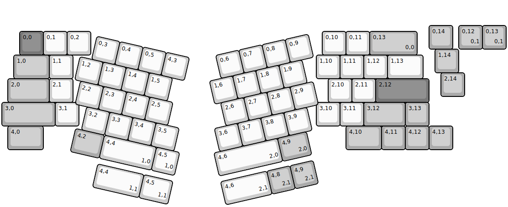
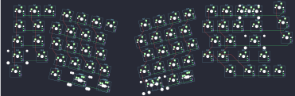

## hineybush/physix_LZ

[layout](physix_LZ-kle.json) - [PCB](physix_LZ.kicad_pcb)

{:loading="lazy"}

[Open in keyboard-layout-editor](http://www.keyboard-layout-editor.com/##@@_x:18&y:1&c=#aaaaaa;&=0,14;&@_x:0.75&y:-0.75&c=#777777;&=0,0&_c=#cccccc;&=0,1&=0,2&_x:9.75;&=0,10&=0,11&_c=#aaaaaa&w:2;&=0,13%0A%0A%0A0,0;&@_x:18.25&y:-0.25;&=1,14;&@_x:0.5&y:-0.75&w:1.5;&=1,0&_c=#cccccc;&=1,1&_x:10.25;&=1,10&=1,11&=1,12&_w:1.5;&=1,13;&@_x:18.5&y:-0.25&c=#aaaaaa;&=2,14;&@_x:0.25&y:-0.75&w:1.75;&=2,0&_c=#cccccc;&=2,1&_x:10.75;&=2,10&=2,11&_c=#777777&w:2.25;&=2,12;&@_c=#aaaaaa&w:2.25;&=3,0&_c=#cccccc;&=3,1&_x:10.0;&=3,10&=3,11&_c=#aaaaaa&w:1.75;&=3,12&=3,13;&@_x:0.25&w:1.5;&=4,0&_x:12.75&w:1.5;&=4,10&=4,11&=4,12&=4,13;&@_r:13&x:4.25&y:-5.75&c=#cccccc;&=0,3&=0,4&=0,5&=4,3;&@_x:3.75;&=1,2&=1,3&=1,4&=1,5;&@_x:4;&=2,2&=2,3&=2,4&=2,5;&@_x:4.5;&=3,2&=3,3&=3,4&=3,5;&@_x:4.25&c=#aaaaaa&w:1.25;&=4,2&_c=#cccccc&w:2.25;&=4,4%0A%0A%0A1,0&=4,5%0A%0A%0A1,0;&@_r:-13&x:8.25&y:-1.25;&=0,6&=0,7&=0,8&=0,9;&@_x:7.75;&=1,6&=1,7&=1,8&=1,9;&@_x:8;&=2,6&=2,7&=2,8&=2,9;&@_x:7.5;&=3,6&=3,7&=3,8&=3,9;&@_x:7.25&w:2.75;&=4,6%0A%0A%0A2,0&_c=#aaaaaa&w:1.25;&=4,9%0A%0A%0A2,0;&@_r:0&x:19.25&y:-8.25;&=0,12%0A%0A%0A0,1&=0,13%0A%0A%0A0,1;&@_r:13&x:5.5&y:3.75&c=#cccccc&w:2;&=4,4%0A%0A%0A1,1&_w:1.25;&=4,5%0A%0A%0A1,1;&@_r:-13&x:7.25&y:2.75&w:2;&=4,6%0A%0A%0A2,1&_c=#aaaaaa;&=4,8%0A%0A%0A2,1&=4,9%0A%0A%0A2,1)

{:loading="lazy"}

