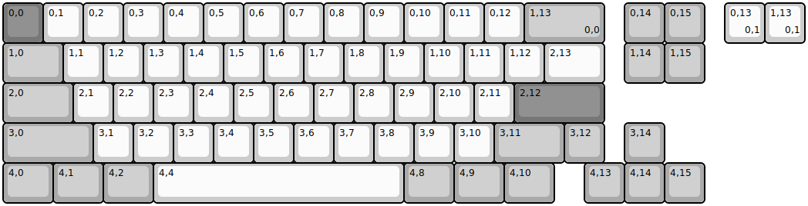
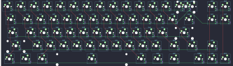

## hineybush/sm68

[layout](sm68-kle.json) - [PCB](sm68.kicad_pcb)

{:loading="lazy"}

[Open in keyboard-layout-editor](http://www.keyboard-layout-editor.com/##@@_c=#777777;&=0,0&_c=#cccccc;&=0,1&=0,2&=0,3&=0,4&=0,5&=0,6&=0,7&=0,8&=0,9&=0,10&=0,11&=0,12&_c=#aaaaaa&w:2;&=1,13%0A%0A%0A0,0&_x:0.5;&=0,14&=0,15;&@_w:1.5;&=1,0&_c=#cccccc;&=1,1&=1,2&=1,3&=1,4&=1,5&=1,6&=1,7&=1,8&=1,9&=1,10&=1,11&=1,12&_w:1.5;&=2,13&_x:0.5&c=#aaaaaa;&=1,14&=1,15;&@_w:1.75;&=2,0&_c=#cccccc;&=2,1&=2,2&=2,3&=2,4&=2,5&=2,6&=2,7&=2,8&=2,9&=2,10&=2,11&_c=#777777&w:2.25;&=2,12;&@_c=#aaaaaa&w:2.25;&=3,0&_c=#cccccc;&=3,1&=3,2&=3,3&=3,4&=3,5&=3,6&=3,7&=3,8&=3,9&=3,10&_c=#aaaaaa&w:1.75;&=3,11&=3,12&_x:0.5;&=3,14;&@_w:1.25;&=4,0&_w:1.25;&=4,1&_w:1.25;&=4,2&_c=#cccccc&w:6.25;&=4,4&_c=#aaaaaa&w:1.25;&=4,8&_w:1.25;&=4,9&_w:1.25;&=4,10&_x:0.75;&=4,13&=4,14&=4,15;&@_x:18.0&y:-5&c=#cccccc;&=0,13%0A%0A%0A0,1&=1,13%0A%0A%0A0,1)

{:loading="lazy"}

