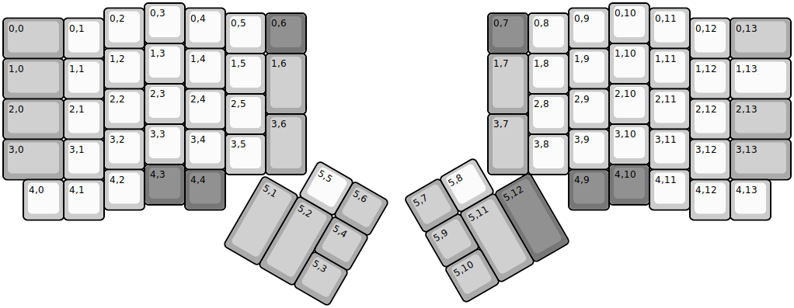
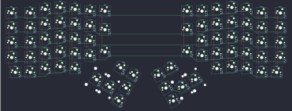

## hotdox/hotdox

[layout](hotdox-kle.json) - [PCB](hotdox.kicad_pcb)

{:loading="lazy"}

[Open in keyboard-layout-editor](http://www.keyboard-layout-editor.com/##@@_x:3.5;&=0,3%0A3&_x:10.5;&=0,10%0A8;&@_x:2.5&y:-0.875;&=0,2%0A2&_x:1.0;&=0,4%0A4&_x:8.5;&=0,9%0A7&_x:1.0;&=0,11%0A9;&@_x:5.5&y:-0.875;&=0,5%0A5&_c=#777777;&=0,6&_x:4.5;&=0,7&_c=#cccccc;&=0,8%0A6;&@_y:-0.875&c=#aaaaaa&w:1.5;&=0,0&_c=#cccccc;&=0,1%0A1&_x:14.5;&=0,12%0A0&_c=#aaaaaa&w:1.5;&=0,13;&@_x:3.5&y:-0.375&c=#cccccc;&=1,3&_x:10.5;&=1,10;&@_x:2.5&y:-0.875;&=1,2&_x:1.0;&=1,4&_x:8.5;&=1,9&_x:1.0;&=1,11;&@_x:5.5&y:-0.875;&=1,5&_c=#aaaaaa&h:1.5;&=1,6&_x:4.5&h:1.5;&=1,7&_c=#cccccc;&=1,8;&@_y:-0.875&c=#aaaaaa&w:1.5;&=1,0&_c=#cccccc;&=1,1&_x:14.5;&=1,12&_w:1.5;&=1,13;&@_x:3.5&y:-0.375;&=2,3&_x:10.5;&=2,10;&@_x:2.5&y:-0.875;&=2,2&_x:1.0;&=2,4&_x:8.5;&=2,9&_x:1.0;&=2,11;&@_x:5.5&y:-0.875;&=2,5&_x:6.5;&=2,8;&@_y:-0.875&c=#aaaaaa&w:1.5;&=2,0&_c=#cccccc;&=2,1&_x:14.5;&=2,12%0A/;&_c=#aaaaaa&w:1.5;&=2,13;&@_x:6.5&y:-0.625&h:1.5;&=3,6&_x:4.5&h:1.5;&=3,7;&@_x:3.5&y:-0.75&c=#cccccc;&=3,3&_x:10.5;&=3,10%0A,;&@_x:2.5&y:-0.875;&=3,2&_x:1.0;&=3,4&_x:8.5;&=3,9&_x:1.0;&=3,11%0A.;&@_x:5.5&y:-0.875;&=3,5&_x:6.5;&=3,8;&@_y:-0.875&c=#aaaaaa&w:1.5;&=3,0&_c=#cccccc;&=3,1&_x:14.5;&=3,12%0A//&_c=#aaaaaa&w:1.5;&=3,13;&@_x:3.5&y:-0.375&c=#777777;&=4,3&_x:10.5;&=4,10;&@_x:2.5&y:-0.875&c=#cccccc;&=4,2&_x:1.0&c=#777777;&=4,4&_x:8.5;&=4,9&_x:1.0&c=#cccccc;&=4,11;&@_x:0.5&y:-0.75;&=4,0&=4,1&_x:14.5;&=4,12&=4,13;&@_r:30&rx:6.5&ry:4.25&x:1.0&y:-1.0;&=5,5&_c=#aaaaaa;&=5,6;&@_h:2;&=5,1&_h:2;&=5,2&=5,4;&@_x:2.0;&=5,3;&@_r:-30&rx:13&x:-3&y:-1.0;&=5,7&_c=#cccccc;&=5,8;&@_x:-3&c=#aaaaaa;&=5,9&_h:2;&=5,11&_c=#777777&h:2;&=5,12;&@_x:-3&c=#aaaaaa;&=5,10)

{:loading="lazy"}

