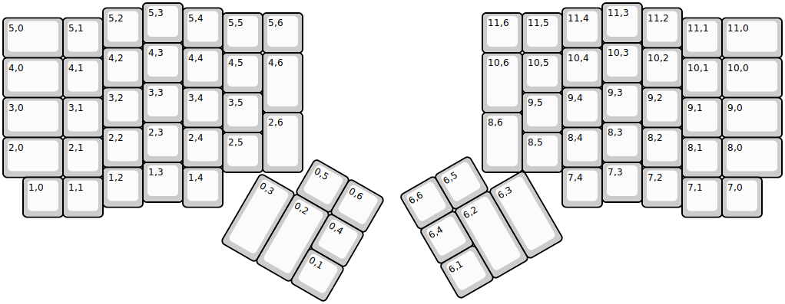
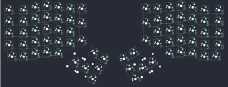

## hotdox76v2/hotdox76v2

[layout](hotdox76v2-kle.json) - [PCB](hotdox76v2.kicad_pcb)

{:loading="lazy"}

[Open in keyboard-layout-editor](http://www.keyboard-layout-editor.com/##@@_x:3.5;&=5,3&_x:10.5;&=11,3;&@_x:2.5&y:-0.875;&=5,2&_x:1.0;&=5,4&_x:8.5;&=11,4&_x:1.0;&=11,2;&@_x:5.5&y:-0.875;&=5,5&=5,6&_x:4.5;&=11,6&=11,5;&@_y:-0.875&w:1.5;&=5,0&=5,1&_x:14.5;&=11,1&_w:1.5;&=11,0;&@_x:3.5&y:-0.375;&=4,3&_x:10.5;&=10,3;&@_x:2.5&y:-0.875;&=4,2&_x:1.0;&=4,4&_x:8.5;&=10,4&_x:1.0;&=10,2;&@_x:5.5&y:-0.875;&=4,5&_h:1.5;&=4,6&_x:4.5&h:1.5;&=10,6&=10,5;&@_y:-0.875&w:1.5;&=4,0&=4,1&_x:14.5;&=10,1&_w:1.5;&=10,0;&@_x:3.5&y:-0.375;&=3,3&_x:10.5;&=9,3;&@_x:2.5&y:-0.875;&=3,2&_x:1.0;&=3,4&_x:8.5;&=9,4&_x:1.0;&=9,2;&@_x:5.5&y:-0.875;&=3,5&_x:6.5;&=9,5;&@_y:-0.875&w:1.5;&=3,0&=3,1&_x:14.5;&=9,1&_w:1.5;&=9,0;&@_x:6.5&y:-0.625&h:1.5;&=2,6&_x:4.5&h:1.5;&=8,6;&@_x:3.5&y:-0.75;&=2,3&_x:10.5;&=8,3;&@_x:2.5&y:-0.875;&=2,2&_x:1.0;&=2,4&_x:8.5;&=8,4&_x:1.0;&=8,2;&@_x:5.5&y:-0.875;&=2,5&_x:6.5;&=8,5;&@_y:-0.875&w:1.5;&=2,0&=2,1&_x:14.5;&=8,1&_w:1.5;&=8,0;&@_x:3.5&y:-0.375;&=1,3&_x:10.5;&=7,3;&@_x:2.5&y:-0.875;&=1,2&_x:1.0;&=1,4&_x:8.5;&=7,4&_x:1.0;&=7,2;&@_x:0.5&y:-0.75;&=1,0&=1,1&_x:14.5;&=7,1&=7,0;&@_r:30&rx:6.5&ry:4.25&x:1.0&y:-1.0;&=0,5&=0,6;&@_h:2;&=0,3&_h:2;&=0,2&=0,4;&@_x:2.0;&=0,1;&@_r:-30&rx:13&x:-3&y:-1.0;&=6,6&=6,5;&@_x:-3;&=6,4&_h:2;&=6,2&_h:2;&=6,3;&@_x:-3;&=6,1)

{:loading="lazy"}

