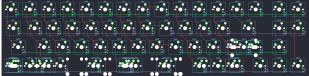

## hubble/hubble

[layout](hubble-kle.json) - [PCB](hubble.kicad_pcb)

{:loading="lazy"}

[Open in keyboard-layout-editor](http://www.keyboard-layout-editor.com/##@@=0,0&=0,1&=0,2&=0,3&=0,4&=0,5&=0,6&=0,7&=1,7&=1,6&=1,5&=1,4&=1,3&=1,2&_x:0.25;&=1,1&=1,0;&@_w:1.25;&=2,0&=2,1&=2,2&=2,3&=2,4&=2,5&=2,6&=2,7&=3,7&=3,6&=3,5&=3,4&_w:1.75;&=3,3&_x:0.25;&=3,1&=3,0;&@_w:1.75;&=4,0&=4,1&=4,2&=4,3&=4,4&=4,5&=4,6&=4,7&=5,7&=5,6&=5,5&_w:2.25;&=5,4%0A%0A%0A0,0&_x:0.25;&=5,1;&@_w:1.25;&=6,0%0A%0A%0A1,0&_w:1.25;&=6,1%0A%0A%0A1,0&_w:1.25;&=6,2%0A%0A%0A1,0&_w:2.25;&=6,3%0A%0A%0A1,0&_w:1.25;&=6,5%0A%0A%0A1,0&_w:2.75;&=6,7%0A%0A%0A1,0&=7,6%0A%0A%0A2,0&=7,5%0A%0A%0A2,0&=7,4%0A%0A%0A2,0&_x:0.25;&=7,2&=7,1&=7,0;&@_x:16.5&y:-2&w:1.25;&=5,4%0A%0A%0A0,1&=5,3%0A%0A%0A0,1&_x:0.25;&=5,4%0A%0A%0A0,2&_w:1.25;&=5,3%0A%0A%0A0,2;&@_y:1.25&w:1.25;&=6,0%0A%0A%0A1,1&_w:1.25;&=6,1%0A%0A%0A1,1&_w:1.25;&=6,2%0A%0A%0A1,1&_w:2.75;&=6,3%0A%0A%0A1,1&_w:1.25;&=6,5%0A%0A%0A1,1&_w:2.25;&=6,7%0A%0A%0A1,1&_w:1.5;&=7,6%0A%0A%0A2,1&_w:1.5;&=7,4%0A%0A%0A2,1;&@_y:0.25&w:1.25;&=6,0%0A%0A%0A1,2&_w:1.25;&=6,1%0A%0A%0A1,2&_w:1.25;&=6,2%0A%0A%0A1,2&_w:6.25;&=6,5%0A%0A%0A1,2;&@_y:0.25;&=6,0%0A%0A%0A1,3&=6,1%0A%0A%0A1,3&=6,2%0A%0A%0A1,3&_w:7;&=6,5%0A%0A%0A1,3;&@_y:0.25&w:1.5;&=6,0%0A%0A%0A1,4&_w:1.5;&=6,2%0A%0A%0A1,4&_w:7;&=6,5%0A%0A%0A1,4)

{:loading="lazy"}

