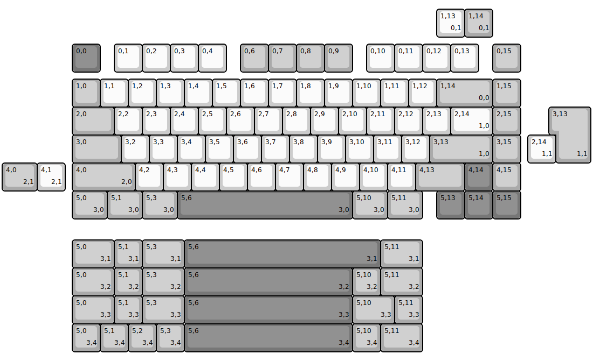
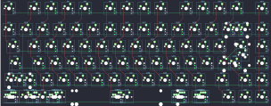

## iLumkb/primus75

[layout](primus75-kle.json) - [PCB](primus75.kicad_pcb)

{:loading="lazy"}

[Open in keyboard-layout-editor](http://www.keyboard-layout-editor.com/##@@_x:2.5&y:1.5&c=#777777;&=0,0&_x:0.5&c=#cccccc;&=0,1&=0,2&=0,3&=0,4&_x:0.5&c=#aaaaaa;&=0,6&=0,7&=0,8&=0,9&_x:0.5&c=#cccccc;&=0,10&=0,11&=0,12&=0,13&_x:0.5&c=#aaaaaa;&=0,15;&@_x:2.5&y:0.25;&=1,0&_c=#cccccc;&=1,1&=1,2&=1,3&=1,4&=1,5&=1,6&=1,7&=1,8&=1,9&=1,10&=1,11&=1,12&_c=#aaaaaa&w:2;&=1,14%0A%0A%0A0,0&=1,15;&@_x:2.5&w:1.5;&=2,0&_c=#cccccc;&=2,2&=2,3&=2,4&=2,5&=2,6&=2,7&=2,8&=2,9&=2,10&=2,11&=2,12&=2,13&_w:1.5;&=2,14%0A%0A%0A1,0&_c=#aaaaaa;&=2,15;&@_x:2.5&w:1.75;&=3,0&_c=#cccccc;&=3,2&=3,3&=3,4&=3,5&=3,6&=3,7&=3,8&=3,9&=3,10&=3,11&=3,12&_c=#aaaaaa&w:2.25;&=3,13%0A%0A%0A1,0&=3,15;&@_x:2.5&w:2.25;&=4,0%0A%0A%0A2,0&_c=#cccccc;&=4,2&=4,3&=4,4&=4,5&=4,6&=4,7&=4,8&=4,9&=4,10&=4,11&_c=#aaaaaa&w:1.75;&=4,13&_c=#777777;&=4,14&_c=#aaaaaa;&=4,15;&@_x:2.5&w:1.25;&=5,0%0A%0A%0A3,0&_w:1.25;&=5,1%0A%0A%0A3,0&_w:1.25;&=5,3%0A%0A%0A3,0&_c=#777777&w:6.25;&=5,6%0A%0A%0A3,0&_c=#aaaaaa&w:1.25;&=5,10%0A%0A%0A3,0&_w:1.25;&=5,11%0A%0A%0A3,0&_x:0.5&c=#777777;&=5,13&=5,14&=5,15;&@_x:15.5&y:-7.5&c=#cccccc;&=1,13%0A%0A%0A0,1&_c=#aaaaaa;&=1,14%0A%0A%0A0,1;&@_x:19.75&y:2.5&w:1.25&h:2&w2:1.5&h2:1&x2:-0.25;&=3,13%0A%0A%0A1,1;&@_x:18.75&c=#cccccc;&=2,14%0A%0A%0A1,1;&@_c=#aaaaaa&w:1.25;&=4,0%0A%0A%0A2,1&_c=#cccccc;&=4,1%0A%0A%0A2,1;&@_x:2.5&y:1.75&c=#aaaaaa&w:1.5;&=5,0%0A%0A%0A3,1&=5,1%0A%0A%0A3,1&_w:1.5;&=5,3%0A%0A%0A3,1&_c=#777777&w:7;&=5,6%0A%0A%0A3,1&_c=#aaaaaa&w:1.5;&=5,11%0A%0A%0A3,1;&@_x:2.5&w:1.5;&=5,0%0A%0A%0A3,2&=5,1%0A%0A%0A3,2&_w:1.5;&=5,3%0A%0A%0A3,2&_c=#777777&w:6;&=5,6%0A%0A%0A3,2&_c=#aaaaaa;&=5,10%0A%0A%0A3,2&_w:1.5;&=5,11%0A%0A%0A3,2;&@_x:2.5&w:1.5;&=5,0%0A%0A%0A3,3&=5,1%0A%0A%0A3,3&_w:1.5;&=5,3%0A%0A%0A3,3&_c=#777777&w:6;&=5,6%0A%0A%0A3,3&_c=#aaaaaa&w:1.5;&=5,10%0A%0A%0A3,3&=5,11%0A%0A%0A3,3;&@_x:2.5;&=5,0%0A%0A%0A3,4&=5,1%0A%0A%0A3,4&=5,2%0A%0A%0A3,4&=5,3%0A%0A%0A3,4&_c=#777777&w:6;&=5,6%0A%0A%0A3,4&_c=#aaaaaa;&=5,10%0A%0A%0A3,4&_w:1.5;&=5,11%0A%0A%0A3,4)

{:loading="lazy"}

