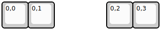
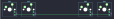

## ianklug/grooveboard

[layout](grooveboard-kle.json) - [PCB](grooveboard.kicad_pcb)

{:loading="lazy"}

[Open in keyboard-layout-editor](http://www.keyboard-layout-editor.com/##@@=0,0&=0,1&_x:2;&=0,2&=0,3)

{:loading="lazy"}

