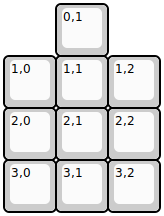
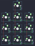

## icesoup/soup10

[layout](soup10-kle.json) - [PCB](soup10.kicad_pcb)

{:loading="lazy"}

[Open in keyboard-layout-editor](http://www.keyboard-layout-editor.com/##@@_x:1;&=0,1;&@=1,0&=1,1&=1,2;&@=2,0&=2,1&=2,2;&@=3,0&=3,1&=3,2)

{:loading="lazy"}

