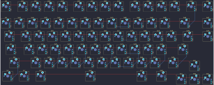
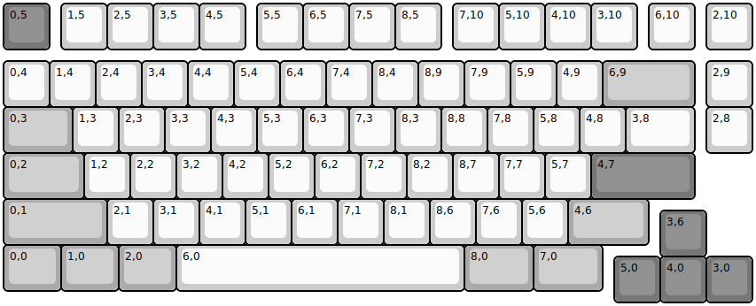
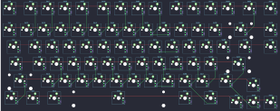
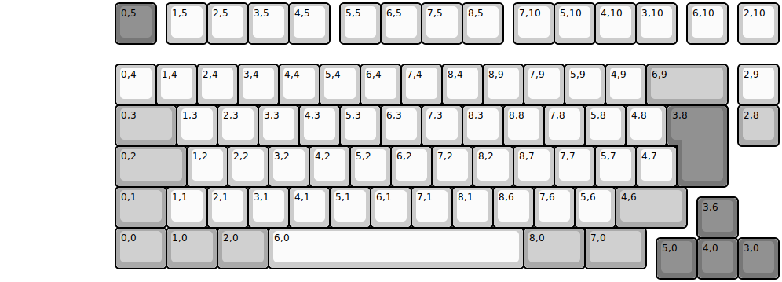
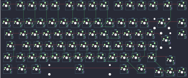

## idobao/id80

[layout](id80-kle.json) - [PCB](id80.kicad_pcb)

{:loading="lazy"}

[Open in keyboard-layout-editor](http://www.keyboard-layout-editor.com/##@@_c=#777777;&=0,5&_x:0.25&c=#cccccc;&=1,5&=2,5&=3,5&=4,5&_x:0.25;&=5,5&=6,5&=7,5&=8,5&_x:0.25;&=7,10&=5,10&=4,10&=3,10&_x:0.25;&=6,10&_x:0.25;&=2,10;&@_y:0.25;&=0,4&=1,4&=2,4&=3,4&=4,4&=5,4&=6,4&=7,4&=8,4&=8,9&=7,9&=5,9&=4,9&_c=#aaaaaa&w:2;&=6,9&_x:0.25&c=#cccccc;&=2,9;&@_c=#aaaaaa&w:1.5;&=0,3&_c=#cccccc;&=1,3&=2,3&=3,3&=4,3&=5,3&=6,3&=7,3&=8,3&=8,8&=7,8&=5,8&=4,8&_w:1.5;&=3,8&_x:0.25;&=2,8;&@_c=#aaaaaa&w:1.75;&=0,2&_c=#cccccc;&=1,2&=2,2&=3,2&=4,2&=5,2&=6,2&=7,2&=8,2&=8,7&=7,7&=5,7&_c=#777777&w:2.25;&=4,7;&@_c=#aaaaaa&w:2.25;&=0,1&_c=#cccccc;&=2,1&=3,1&=4,1&=5,1&=6,1&=7,1&=8,1&=8,6&=7,6&=5,6&_c=#aaaaaa&w:1.75;&=4,6;&@_x:14.25&y:-0.75&c=#777777;&=3,6;&@_y:-0.25&c=#aaaaaa&w:1.25;&=0,0&_w:1.25;&=1,0&_w:1.25;&=2,0&_c=#cccccc&w:6.25;&=6,0&_c=#aaaaaa&w:1.5;&=8,0&_w:1.5;&=7,0;&@_x:13.25&y:-0.75&c=#777777;&=5,0&=4,0&=3,0)

{:loading="lazy"}

## idobao/id80/id80-v3

[layout](id80-v3-kle.json) - [PCB](id80-v3.kicad_pcb)

{:loading="lazy"}

[Open in keyboard-layout-editor](http://www.keyboard-layout-editor.com/##@@_c=#777777;&=0,5&_x:0.25&c=#cccccc;&=1,5&=2,5&=3,5&=4,5&_x:0.25;&=5,5&=6,5&=7,5&=8,5&_x:0.25;&=7,10&=5,10&=4,10&=3,10&_x:0.25;&=6,10&_x:0.25;&=2,10;&@_y:0.25;&=0,4&=1,4&=2,4&=3,4&=4,4&=5,4&=6,4&=7,4&=8,4&=8,9&=7,9&=5,9&=4,9&_c=#aaaaaa&w:2;&=6,9&_x:0.25&c=#cccccc;&=2,9;&@_c=#aaaaaa&w:1.5;&=0,3&_c=#cccccc;&=1,3&=2,3&=3,3&=4,3&=5,3&=6,3&=7,3&=8,3&=8,8&=7,8&=5,8&=4,8&_w:1.5;&=3,8&_x:0.25;&=2,8;&@_c=#aaaaaa&w:1.75;&=0,2&_c=#cccccc;&=1,2&=2,2&=3,2&=4,2&=5,2&=6,2&=7,2&=8,2&=8,7&=7,7&=5,7&_c=#777777&w:2.25;&=4,7;&@_c=#aaaaaa&w:2.25;&=0,1&_c=#cccccc;&=2,1&=3,1&=4,1&=5,1&=6,1&=7,1&=8,1&=8,6&=7,6&=5,6&_c=#aaaaaa&w:1.75;&=4,6;&@_x:14.25&y:-0.75&c=#777777;&=3,6;&@_y:-0.25&c=#aaaaaa&w:1.25;&=0,0&_w:1.25;&=1,0&_w:1.25;&=2,0&_c=#cccccc&w:6.25;&=6,0&_c=#aaaaaa&w:1.5;&=8,0&_w:1.5;&=7,0;&@_x:13.25&y:-0.75&c=#777777;&=5,0&=4,0&=3,0)

{:loading="lazy"}

## idobao/id80/id80iso

[layout](id80iso-kle.json) - [PCB](id80iso.kicad_pcb)

{:loading="lazy"}

[Open in keyboard-layout-editor](http://www.keyboard-layout-editor.com/##@@_x:2.75&c=#777777;&=0,5&_x:0.25&c=#cccccc;&=1,5&=2,5&=3,5&=4,5&_x:0.25;&=5,5&=6,5&=7,5&=8,5&_x:0.25;&=7,10&=5,10&=4,10&=3,10&_x:0.25;&=6,10&_x:0.25;&=2,10;&@_x:2.75&y:0.5;&=0,4&=1,4&=2,4&=3,4&=4,4&=5,4&=6,4&=7,4&=8,4&=8,9&=7,9&=5,9&=4,9&_c=#aaaaaa&w:2;&=6,9&_x:0.25&c=#cccccc;&=2,9;&@_x:2.75&c=#aaaaaa&w:1.5;&=0,3&_c=#cccccc;&=1,3&=2,3&=3,3&=4,3&=5,3&=6,3&=7,3&=8,3&=8,8&=7,8&=5,8&=4,8&_x:0.25&c=#777777&w:1.25&h:2&w2:1.5&h2:1&x2:-0.25;&=3,8&_x:0.25&c=#aaaaaa;&=2,8;&@_x:2.75&w:1.75;&=0,2&_c=#cccccc;&=1,2&=2,2&=3,2&=4,2&=5,2&=6,2&=7,2&=8,2&=8,7&=7,7&=5,7&=4,7;&@_x:2.75&c=#aaaaaa&w:1.25;&=0,1&_c=#cccccc;&=1,1&=2,1&=3,1&=4,1&=5,1&=6,1&=7,1&=8,1&=8,6&=7,6&=5,6&_c=#aaaaaa&w:1.75;&=4,6;&@_x:17&y:-0.75&c=#777777;&=3,6;&@_x:2.75&y:-0.25&c=#aaaaaa&w:1.25;&=0,0&_w:1.25;&=1,0&_w:1.25;&=2,0&_c=#cccccc&w:6.25;&=6,0&_c=#aaaaaa&w:1.5;&=8,0&_w:1.5;&=7,0;&@_x:16&y:-0.75&c=#777777;&=5,0&=4,0&=3,0)

{:loading="lazy"}

