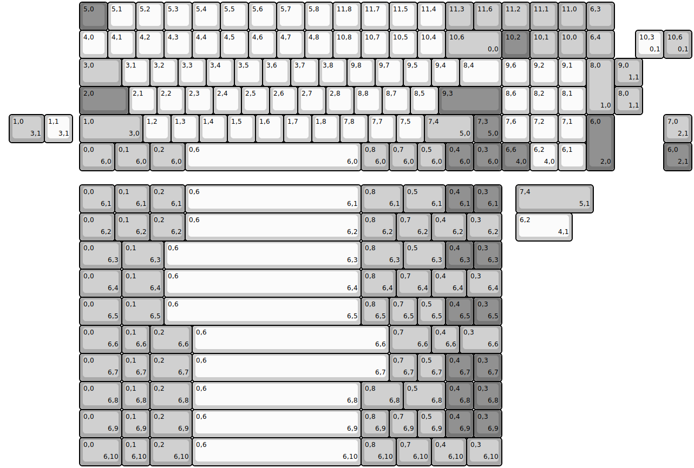
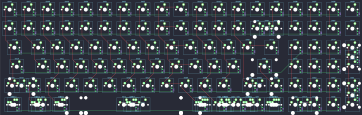

## idobao/id96

[layout](id96-kle.json) - [PCB](id96.kicad_pcb)

{:loading="lazy"}

[Open in keyboard-layout-editor](http://www.keyboard-layout-editor.com/##@@_x:2.75&c=#777777;&=5,0&_c=#cccccc;&=5,1&=5,2&=5,3&=5,4&=5,5&=5,6&=5,7&=5,8&=11,8&=11,7&=11,5&=11,4&_c=#aaaaaa;&=11,3&=11,6&=11,2&=11,1&=11,0&=6,3;&@_x:2.75&c=#cccccc;&=4,0&=4,1&=4,2&=4,3&=4,4&=4,5&=4,6&=4,7&=4,8&=10,8&=10,7&=10,5&=10,4&_c=#aaaaaa&w:2;&=10,6%0A%0A%0A0,0&_c=#777777;&=10,2&_c=#aaaaaa;&=10,1&=10,0&=6,4;&@_x:2.75&w:1.5;&=3,0&_c=#cccccc;&=3,1&=3,2&=3,3&=3,4&=3,5&=3,6&=3,7&=3,8&=9,8&=9,7&=9,5&=9,4&_w:1.5;&=8,4&=9,6&=9,2&=9,1&_c=#aaaaaa&h:2;&=8,0%0A%0A%0A1,0;&@_x:2.75&c=#777777&w:1.75;&=2,0&_c=#cccccc;&=2,1&=2,2&=2,3&=2,4&=2,5&=2,6&=2,7&=2,8&=8,8&=8,7&=8,5&_c=#777777&w:2.25;&=9,3&_c=#cccccc;&=8,6&=8,2&=8,1;&@_x:2.75&c=#aaaaaa&w:2.25;&=1,0%0A%0A%0A3,0&_c=#cccccc;&=1,2&=1,3&=1,4&=1,5&=1,6&=1,7&=1,8&=7,8&=7,7&=7,5&_c=#aaaaaa&w:1.75;&=7,4%0A%0A%0A5,0&_c=#777777;&=7,3%0A%0A%0A5,0&_c=#cccccc;&=7,6&=7,2&=7,1&_c=#777777&h:2;&=6,0%0A%0A%0A2,0;&@_x:2.75&c=#aaaaaa&w:1.25;&=0,0%0A%0A%0A6,0&_w:1.25;&=0,1%0A%0A%0A6,0&_w:1.25;&=0,2%0A%0A%0A6,0&_c=#cccccc&w:6.25;&=0,6%0A%0A%0A6,0&_c=#aaaaaa;&=0,8%0A%0A%0A6,0&=0,7%0A%0A%0A6,0&=0,5%0A%0A%0A6,0&_c=#777777;&=0,4%0A%0A%0A6,0&=0,3%0A%0A%0A6,0&=6,6%0A%0A%0A4,0&_c=#cccccc;&=6,2%0A%0A%0A4,0&=6,1;&@_x:22.5&y:-5;&=10,3%0A%0A%0A0,1&_c=#aaaaaa;&=10,6%0A%0A%0A0,1;&@_x:21.75;&=9,0%0A%0A%0A1,1;&@_x:21.75;&=8,0%0A%0A%0A1,1;&@_x:0.25&w:1.25;&=1,0%0A%0A%0A3,1&_c=#cccccc;&=1,1%0A%0A%0A3,1&_x:21.0&c=#aaaaaa;&=7,0%0A%0A%0A2,1;&@_x:23.5&c=#777777;&=6,0%0A%0A%0A2,1;&@_x:2.75&y:0.5&c=#aaaaaa&w:1.25;&=0,0%0A%0A%0A6,1&_w:1.25;&=0,1%0A%0A%0A6,1&_w:1.25;&=0,2%0A%0A%0A6,1&_c=#cccccc&w:6.25;&=0,6%0A%0A%0A6,1&_c=#aaaaaa&w:1.5;&=0,8%0A%0A%0A6,1&_w:1.5;&=0,5%0A%0A%0A6,1&_c=#777777;&=0,4%0A%0A%0A6,1&=0,3%0A%0A%0A6,1&_x:0.5&c=#aaaaaa&w:2.75;&=7,4%0A%0A%0A5,1;&@_x:2.75&w:1.25;&=0,0%0A%0A%0A6,2&_w:1.25;&=0,1%0A%0A%0A6,2&_w:1.25;&=0,2%0A%0A%0A6,2&_c=#cccccc&w:6.25;&=0,6%0A%0A%0A6,2&_c=#aaaaaa&w:1.25;&=0,8%0A%0A%0A6,2&_w:1.25;&=0,7%0A%0A%0A6,2&_w:1.25;&=0,4%0A%0A%0A6,2&_w:1.25;&=0,3%0A%0A%0A6,2&_x:0.5&c=#cccccc&w:2;&=6,2%0A%0A%0A4,1;&@_x:2.75&c=#aaaaaa&w:1.5;&=0,0%0A%0A%0A6,3&_w:1.5;&=0,1%0A%0A%0A6,3&_c=#cccccc&w:7;&=0,6%0A%0A%0A6,3&_c=#aaaaaa&w:1.5;&=0,8%0A%0A%0A6,3&_w:1.5;&=0,5%0A%0A%0A6,3&_c=#777777;&=0,4%0A%0A%0A6,3&=0,3%0A%0A%0A6,3;&@_x:2.75&c=#aaaaaa&w:1.5;&=0,0%0A%0A%0A6,4&_w:1.5;&=0,1%0A%0A%0A6,4&_c=#cccccc&w:7;&=0,6%0A%0A%0A6,4&_c=#aaaaaa&w:1.25;&=0,8%0A%0A%0A6,4&_w:1.25;&=0,7%0A%0A%0A6,4&_w:1.25;&=0,4%0A%0A%0A6,4&_w:1.25;&=0,3%0A%0A%0A6,4;&@_x:2.75&w:1.5;&=0,0%0A%0A%0A6,5&_w:1.5;&=0,1%0A%0A%0A6,5&_c=#cccccc&w:7;&=0,6%0A%0A%0A6,5&_c=#aaaaaa;&=0,8%0A%0A%0A6,5&=0,7%0A%0A%0A6,5&=0,5%0A%0A%0A6,5&_c=#777777;&=0,4%0A%0A%0A6,5&=0,3%0A%0A%0A6,5;&@_x:2.75&c=#aaaaaa&w:1.5;&=0,0%0A%0A%0A6,6&=0,1%0A%0A%0A6,6&_w:1.5;&=0,2%0A%0A%0A6,6&_c=#cccccc&w:7;&=0,6%0A%0A%0A6,6&_c=#aaaaaa&w:1.5;&=0,7%0A%0A%0A6,6&=0,4%0A%0A%0A6,6&_w:1.5;&=0,3%0A%0A%0A6,6;&@_x:2.75&w:1.5;&=0,0%0A%0A%0A6,7&=0,1%0A%0A%0A6,7&_w:1.5;&=0,2%0A%0A%0A6,7&_c=#cccccc&w:7;&=0,6%0A%0A%0A6,7&_c=#aaaaaa;&=0,7%0A%0A%0A6,7&=0,5%0A%0A%0A6,7&_c=#777777;&=0,4%0A%0A%0A6,7&=0,3%0A%0A%0A6,7;&@_x:2.75&c=#aaaaaa&w:1.5;&=0,0%0A%0A%0A6,8&=0,1%0A%0A%0A6,8&_w:1.5;&=0,2%0A%0A%0A6,8&_c=#cccccc&w:6;&=0,6%0A%0A%0A6,8&_c=#aaaaaa&w:1.5;&=0,8%0A%0A%0A6,8&_w:1.5;&=0,5%0A%0A%0A6,8&_c=#777777;&=0,4%0A%0A%0A6,8&=0,3%0A%0A%0A6,8;&@_x:2.75&c=#aaaaaa&w:1.5;&=0,0%0A%0A%0A6,9&=0,1%0A%0A%0A6,9&_w:1.5;&=0,2%0A%0A%0A6,9&_c=#cccccc&w:6;&=0,6%0A%0A%0A6,9&_c=#aaaaaa;&=0,8%0A%0A%0A6,9&=0,7%0A%0A%0A6,9&=0,5%0A%0A%0A6,9&_c=#777777;&=0,4%0A%0A%0A6,9&=0,3%0A%0A%0A6,9;&@_x:2.75&c=#aaaaaa&w:1.5;&=0,0%0A%0A%0A6,10&=0,1%0A%0A%0A6,10&_w:1.5;&=0,2%0A%0A%0A6,10&_c=#cccccc&w:6;&=0,6%0A%0A%0A6,10&_c=#aaaaaa&w:1.25;&=0,8%0A%0A%0A6,10&_w:1.25;&=0,7%0A%0A%0A6,10&_w:1.25;&=0,4%0A%0A%0A6,10&_w:1.25;&=0,3%0A%0A%0A6,10)

{:loading="lazy"}

