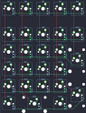
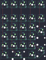
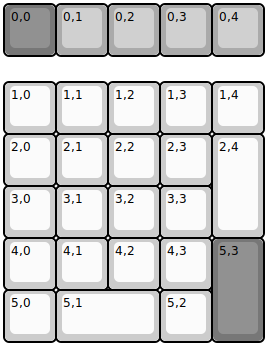
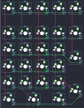

## idobao/montex

[layout](montex-kle.json) - [PCB](montex.kicad_pcb)

{:loading="lazy"}

[Open in keyboard-layout-editor](http://www.keyboard-layout-editor.com/##@@_c=#777777;&=0,0&_c=#aaaaaa;&=0,1&=0,2&=0,3&=0,4;&@_y:0.5&c=#cccccc;&=1,0&=1,1&=1,2&=1,3&=1,4;&@=2,0&=2,1&=2,2&=2,3&_h:2&h2:1;&=2,4;&@=3,0&=3,1&=3,2&=3,3;&@=4,0&=4,1&=4,2&=4,3&_c=#777777&h:2&h2:1;&=5,3;&@_c=#cccccc;&=5,0&_w:2;&=5,1&=5,2)

{:loading="lazy"}

## idobao/montex/montex-v1rgb

[layout](montex-v1rgb-kle.json) - [PCB](montex-v1rgb.kicad_pcb)

{:loading="lazy"}

[Open in keyboard-layout-editor](http://www.keyboard-layout-editor.com/##@@_c=#777777;&=0,0&_c=#aaaaaa;&=0,1&=0,2&=0,3&=0,4;&@_y:0.5&c=#cccccc;&=1,0&=1,1&=1,2&=1,3&=1,4;&@=2,0&=2,1&=2,2&=2,3&_h:2;&=2,4;&@=3,0&=3,1&=3,2&=3,3;&@=4,0&=4,1&=4,2&=4,3&_c=#777777&h:2;&=5,3;&@_c=#cccccc;&=5,0&_w:2;&=5,1&=5,2)

{:loading="lazy"}

## idobao/montex/montex-v2

[layout](montex-v2-kle.json) - [PCB](montex-v2.kicad_pcb)

{:loading="lazy"}

[Open in keyboard-layout-editor](http://www.keyboard-layout-editor.com/##@@_c=#777777;&=0,0&_c=#aaaaaa;&=0,1&=0,2&=0,3&=0,4;&@_y:0.5&c=#cccccc;&=1,0&=1,1&=1,2&=1,3&=1,4;&@=2,0&=2,1&=2,2&=2,3&_h:2;&=2,4;&@=3,0&=3,1&=3,2&=3,3;&@=4,0&=4,1&=4,2&=4,3&_c=#777777&h:2;&=5,3;&@_c=#cccccc;&=5,0&_w:2;&=5,1&=5,2)

{:loading="lazy"}

