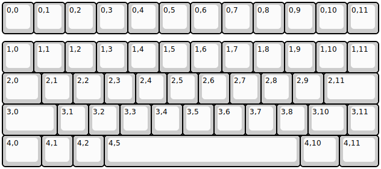
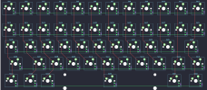

## idyllic/tinny50_rgb

[layout](tinny50_rgb-kle.json) - [PCB](tinny50_rgb.kicad_pcb)

{:loading="lazy"}

[Open in keyboard-layout-editor](http://www.keyboard-layout-editor.com/##@@=0,0&=0,1&=0,2&=0,3&=0,4&=0,5&=0,6&=0,7&=0,8&=0,9&=0,10&=0,11;&@_y:0.25;&=1,0&=1,1&=1,2&=1,3&=1,4&=1,5&=1,6&=1,7&=1,8&=1,9&=1,10&=1,11;&@_w:1.25;&=2,0&=2,1&=2,2&=2,3&=2,4&=2,5&=2,6&=2,7&=2,8&=2,9&_w:1.75;&=2,11;&@_w:1.75;&=3,0&=3,1&=3,2&=3,3&=3,4&=3,5&=3,6&=3,7&=3,8&_w:1.25;&=3,10&=3,11;&@_w:1.25;&=4,0&=4,1&=4,2&_w:6.25;&=4,5&_w:1.25;&=4,10&_w:1.25;&=4,11)

{:loading="lazy"}

